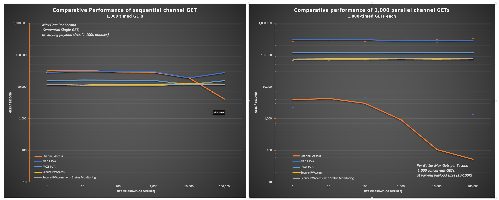

.. _cli_tools:

|cli| Command Line Tools
=========================

SPVA provides two command line tools for certificate management and performance benchmarking.

.. _pvxcert:

|terminal| pvxcert — Certificate Management
--------------------------------------------

``pvxcert`` is a certificate management utility for querying certificate status and performing
administrative operations such as approving, denying, or revoking certificates managed by :ref:`pvacms`.

Usage
^^^^^

.. code-block:: text

   pvxcert [options] <cert_id>                          Get certificate status
   pvxcert [file_options] [options] -f <cert_file>      Get certificate info from file
   pvxcert [options] -A <cert_id>                       Approve pending request (admin)
   pvxcert [options] -D <cert_id>                       Deny pending request (admin)
   pvxcert [options] -R <cert_id>                       Revoke certificate (admin)
   pvxcert -h                                           Show help
   pvxcert -V                                           Print version

Certificate ID Format
^^^^^^^^^^^^^^^^^^^^^

Certificates are identified by a compound ``<issuer>:<serial>`` string:

- ``<issuer>`` — first 8 hex digits of the issuer's Subject Key Identifier
- ``<serial>`` — certificate serial number

For example::

   27975e6b:7246297371190731775

This ID is displayed when certificates are created or can be found in the certificate details
of PKCS#12 keychain files.

Options
^^^^^^^

.. list-table::
   :widths: 30 70
   :header-rows: 1

   * - Option
     - Description
   * - ``<cert_id>``
     - Certificate identifier in ``<issuer>:<serial>`` format
   * - ``-f``, ``--file`` ``<cert_file>``
     - Read certificate information from a PKCS#12 keychain file
   * - ``-p``, ``--password``
     - Prompt for keychain file password (use with ``-f``)
   * - ``-A``, ``--approve`` ``<cert_id>``
     - Approve a pending certificate request (**admin only**)
   * - ``-D``, ``--deny`` ``<cert_id>``
     - Deny a pending certificate request (**admin only**)
   * - ``-R``, ``--revoke`` ``<cert_id>``
     - Revoke an active certificate (**admin only**)
   * - ``-w``, ``--timeout`` ``<seconds>``
     - Operation timeout in seconds (default: 5.0)
   * - ``-d``, ``--debug``
     - Enable debug logging (sets ``PVXS_LOG="pvxs.*=DEBUG"``)
   * - ``-v``, ``--verbose``
     - Enable verbose output
   * - ``-h``, ``--help``
     - Show help message
   * - ``-V``, ``--version``
     - Print version information

Examples
^^^^^^^^

**Check certificate status:**

.. code-block:: shell

   # Query status by certificate ID
   pvxcert 27975e6b:7246297371190731775

   # Query status from a keychain file
   pvxcert -f ~/.config/pva/1.5/client.p12

   # Query a password-protected keychain file
   pvxcert -p -f /path/to/server.p12

**Administrative operations:**

.. code-block:: shell

   # Approve a pending certificate request
   pvxcert -A 27975e6b:7246297371190731775

   # Deny a pending certificate request
   pvxcert -D 27975e6b:7246297371190731775

   # Revoke an active certificate
   pvxcert -R 27975e6b:7246297371190731775

.. note::

   Administrative operations (approve, deny, revoke) require appropriate access
   control permissions configured in the :ref:`pvacms` ACF.

Under the hood, ``pvxcert`` sends a ``PUT`` to the :ref:`pvacms` on the PV associated with the certificate:

.. code-block:: console

    Structure
        string     state    # APPROVE, DENY, REVOKE

.. _pvxperf:

|terminal| pvxperf — GET Latency and Throughput Benchmark
----------------------------------------------------------

``pvxperf`` is a self-contained benchmark that measures GET round-trip latency and throughput
across five protocol modes. It quantifies the performance cost of TLS and certificate monitoring
relative to plain PVA, running all traffic over loopback for repeatable results on the same hardware.

Protocol Modes
^^^^^^^^^^^^^^

.. list-table::
   :widths: 18 22 22 22 8 8
   :header-rows: 1

   * - Mode
     - Client
     - Server
     - PV Name
     - TLS
     - Cert Monitoring
   * - ``CA``
     - ``ca_array_get()`` / ``ca_array_get_callback()``
     - ``softIoc`` child process
     - ``PVXPERF:CA:BENCH``
     - N/A
     - N/A
   * - ``EPICS_PVA``
     - pvAccessCPP ``ChannelGet::get()``
     - ``softIocPVA`` child process
     - ``PVXPERF:CA:BENCH``
     - No
     - No
   * - ``PVXS_PVA``
     - pvxs ``reExecGet()`` expert API
     - In-process ``BenchmarkSource`` (default) or ``softIocPVX`` child (``--pvxs-server external``)
     - ``PVXPERF:PVXS_PVA:BENCH`` (in-process) / ``PVXPERF:PVXS:BENCH`` (external)
     - No
     - No
   * - ``SPVA``
     - pvxs ``reExecGet()`` over TLS
     - In-process ``BenchmarkSource`` (default) or ``softIocPVX`` child (``--pvxs-server external``)
     - ``PVXPERF:SPVA:BENCH`` (in-process) / ``PVXPERF:PVXS:BENCH`` (external)
     - Yes
     - ``disableStatusCheck(true)``
   * - ``SPVA_CERTMON``
     - pvxs ``reExecGet()`` over TLS
     - In-process ``BenchmarkSource`` (default) or ``softIocPVX`` child (``--pvxs-server external``)
     - ``PVXPERF:SPVA_CERTMON:BENCH`` (in-process) / ``PVXPERF:PVXS:BENCH`` (external)
     - Yes
     - Real PVACMS

Server Implementations
^^^^^^^^^^^^^^^^^^^^^^

**CA and EPICS_PVA** use external ``softIoc`` / ``softIocPVA`` child processes (fork/exec) serving
a waveform record. This ensures real TCP loopback communication, not in-process shortcuts. The IOC
executables are located via compile-time paths (``PVXPERF_EPICS_BASE`` and ``PVXPERF_PVXS``).

**PVXS_PVA, SPVA, and SPVA_CERTMON** default to an in-process ``BenchmarkSource``, a custom
``server::Source`` subclass that stamps each GET response with a ``benchCounter`` (monotonically
incrementing ``UInt64``) and ``benchTimestampNs`` (``Int64``, steady_clock nanoseconds). Unlike
``SharedPV::buildReadonly()`` which clones a cached value, ``BenchmarkSource`` creates a fresh
response for every GET. Use ``--pvxs-server external`` to switch to a ``softIocPVX`` child process
(pvxs-based IOC, supports TLS) for an apples-to-apples comparison with CA/EPICS_PVA.

Payload Structure
^^^^^^^^^^^^^^^^^

The response type extends ``NTScalar{Float64A}`` with two additional fields:

.. code-block:: text

   value            : Float64A  (array of doubles, size = --sizes parameter)
   benchCounter     : UInt64    (increments per GET, server-side)
   benchTimestampNs : Int64     (steady_clock nanoseconds at server reply time)

Usage
^^^^^

.. code-block:: text

   pvxperf [options]           Run benchmarks
   pvxperf -h                  Show help
   pvxperf -V                  Print version

CLI Options
^^^^^^^^^^^

.. list-table::
   :widths: 35 50 15
   :header-rows: 1

   * - Option
     - Description
     - Default
   * - ``--modes`` ``<list>``
     - Comma-separated protocol modes: ``ca,epics_pva,pvxs_pva,spva,spva_certmon``
     - all five
   * - ``--sizes`` ``<list>``
     - Comma-separated array sizes in doubles
     - ``1,10,100,1000,10000,100000``
   * - ``--parallelism`` ``<list>``
     - Comma-separated parallelism values
     - ``1,10,100,1000``
   * - ``--samples`` ``<N>``
     - Number of measured GETs per data point
     - ``1000``
   * - ``--warmup`` ``<N>``
     - Number of warmup GETs to discard
     - ``100``
   * - ``--output`` ``<file>``
     - CSV output file
     - stdout
   * - ``--pvxs-server`` ``<mode>``
     - PVXS server: ``in-process`` (BenchmarkSource) or ``external`` (softIocPVX child)
     - ``in-process``
   * - ``--keychain`` ``<path>``
     - TLS keychain file for SPVA modes
     -
   * - ``--setup-cms``
     - Auto-bootstrap PVACMS with temp certs (see :ref:`cms_bootstrap`)
     -
   * - ``--external-cms``
     - Use an already-running PVACMS instance
     -
   * - ``--cms-db`` ``<path>``
     - Path to existing PVACMS SQLite database
     -
   * - ``--cms-keychain`` ``<path>``
     - Path to existing PVACMS server keychain
     -
   * - ``--cms-acf`` ``<path>``
     - Path to existing PVACMS ACF file
     -
   * - ``--benchmark-phases``
     - Run connection phase timing after the GET benchmark
     -
   * - ``--phase-iterations`` ``<N>``
     - Connect/disconnect cycles for phase timing
     - ``50``
   * - ``--phase-output`` ``<file>``
     - Separate CSV file for phase timing results
     -
   * - ``-d``, ``--debug``
     - Enable PVXS debug logging
     -
   * - ``-V``, ``--version``
     - Print version and exit
     -
   * - ``-v``, ``--verbose``
     - Verbose mode
     -

Example: Full Benchmark with Phase Timing
^^^^^^^^^^^^^^^^^^^^^^^^^^^^^^^^^^^^^^^^^

.. code-block:: shell

   pvxperf --setup-cms \
       --modes ca,epics_pva,pvxs_pva,spva,spva_certmon \
       --sizes 1,10,100,1000,10000,100000 \
       --parallelism 1,10,100,1000 \
       --samples 1000 --warmup 100 \
       --output results/pvxperf_get_results.csv \
       --benchmark-phases --phase-iterations 50 \
       --phase-output results/pvxperf_phases.csv

CSV Output Schemas
^^^^^^^^^^^^^^^^^^

**GET Throughput CSV** — one row per sample per data point:

.. code-block:: text

   protocol,array_size,parallelism,iteration,gets_per_second,per_getter_gets_per_second,total_gets,duration_seconds

.. list-table::
   :widths: 35 65
   :header-rows: 1

   * - Column
     - Description
   * - ``protocol``
     - ``CA``, ``EPICS_PVA``, ``PVXS_PVA``, ``SPVA``, or ``SPVA_CERTMON``
   * - ``array_size``
     - Number of doubles in the response array
   * - ``parallelism``
     - Number of parallel GET operations
   * - ``iteration``
     - Sample number (1..N where N = ``--samples``)
   * - ``gets_per_second``
     - Aggregate throughput: ``parallelism × 1e6 / per_get_us``
   * - ``per_getter_gets_per_second``
     - Per-getter throughput: ``1e6 / per_get_us``
   * - ``total_gets``
     - Number of GETs in this batch (= parallelism)
   * - ``duration_seconds``
     - Wall-clock time for this batch

**Phase Timing CSV** — one row per phase per iteration:

.. code-block:: text

   test_type,protocol,iteration,phase,duration_us

.. list-table::
   :widths: 25 75
   :header-rows: 1

   * - Column
     - Description
   * - ``test_type``
     - Always ``connection_phase``
   * - ``protocol``
     - ``PVXS_PVA``, ``SPVA``, or ``SPVA_CERTMON``
   * - ``iteration``
     - Cycle number (1..N where N = ``--phase-iterations``)
   * - ``phase``
     - ``search``, ``tcp_connect``, ``validation``, ``create_channel``, or ``total``
   * - ``duration_us``
     - Duration in microseconds

.. _benchmark_methodology:

Measurement Methodology
^^^^^^^^^^^^^^^^^^^^^^^

``pvxperf`` measures wall-clock time of individual GET operations (or batches of parallel GETs).

**GET Benchmark**

Each data point (mode × array_size × parallelism) consists of:

1. **Connection setup** — client connects to server, performs PVA INIT handshake once per Operation
2. **Warmup phase** — N GETs discarded to stabilise connections, caches, and JIT paths
3. **Measurement phase** — N timed GET samples
4. **Statistics** — median, mean, P25/P75/P99, min/max, coefficient of variation (CV%), and
   throughput (gets/sec derived from median latency)

The pvxs ``reExecGet()`` API (enabled via ``PVXS_ENABLE_EXPERT_API``) performs the PVA INIT
handshake once per Operation, then each subsequent ``reExecGet()`` call sends only the EXEC
message, achieving true single-round-trip GETs comparable to CA's ``ca_array_get()``.

For parallel GETs (parallelism > 1), all N Operations are created with ``autoExec(false)``,
initialised in parallel, then for each sample all N ``reExecGet()`` calls are issued
simultaneously. The batch completion time is measured and per-GET latency is ``batch_time / N``.

**Connection Phase Timing**

Measures per-phase connection setup overhead by parsing pvxs debug log messages captured via
``errlogAddListener()``. Only ``PVXS_PVA``, ``SPVA``, and ``SPVA_CERTMON`` are measured; CA and
EPICS_PVA are excluded.

Two pvxs loggers are set to DEBUG during phase timing:

- ``pvxs.st.cli`` — state transition messages (Connecting, Connected, Validated, Active)
- ``pvxs.cli.io`` — protocol message arrivals (search responses)

.. list-table::
   :widths: 22 39 39
   :header-rows: 1

   * - Phase
     - Start Event
     - End Event
   * - ``search``
     - First ``Search tick`` message
     - ``Connecting`` state transition
   * - ``tcp_connect``
     - ``Connecting``
     - ``Connected`` (includes TLS handshake for SPVA modes)
   * - ``validation``
     - ``Connected``
     - ``Validated`` (PVA auth negotiation)
   * - ``create_channel``
     - ``Validated``
     - ``Active`` (for SPVA_CERTMON, gated on cert status)
   * - ``total``
     - End-to-end from first search
     - Channel active

Each iteration is a full connect, GET, disconnect cycle with a fresh client and server.

.. note::

   For ``SPVA_CERTMON``, inner cert-status clients also produce log messages. These are filtered
   by PV name (only ``PVXPERF:`` messages for channel transitions) and by port-based whitelist
   (only the benchmark server's known TCP/TLS ports for connection transitions).

.. _cms_bootstrap:

CMS Bootstrap (``--setup-cms``)
^^^^^^^^^^^^^^^^^^^^^^^^^^^^^^^

The ``--setup-cms`` option bootstraps the entire PVACMS and certificate infrastructure from
scratch, creating a fully isolated temporary environment that won't interfere with any existing
PVACMS installation:

1. Creates a temp directory (``mkdtemp("pvxperf-cms-XXXXXX")``) for all CMS state
2. Launches ``pvacms`` as a child process with all state isolated:

   .. code-block:: shell

      pvacms --certs-dont-require-approval \
        -c <tmpdir>/cert_auth.p12 -d <tmpdir>/certs.db \
        -p <tmpdir>/pvacms.p12 --acf <tmpdir>/pvacms.acf \
        -a <tmpdir>/admin.p12

3. Waits for PVACMS readiness (probes ``CERT:ROOT:*`` PV)
4. Provisions server keychain via ``authnstd -n pvxperf-server -u server``
5. Provisions client keychain via ``authnstd -n pvxperf-client -u client``
6. Runs benchmarks using the provisioned keychains
7. On cleanup: sends SIGTERM to PVACMS and removes the temp directory

PVACMS runs on fixed non-default ports (UDP 15076, TCP 15075, TLS 15076) to avoid collision with
production services. All benchmark traffic stays on loopback.

Use ``--external-cms`` to point at an already-running PVACMS, or supply explicit paths with
``--cms-db``, ``--cms-keychain``, and ``--cms-acf``.

Network Architecture
^^^^^^^^^^^^^^^^^^^^

**Loopback Server Configuration**

``PVXS_PVA``, ``SPVA``, and ``SPVA_CERTMON`` servers use ``loopbackServerConfig()``, which binds
to ``127.0.0.1`` on ephemeral ports with ``auto_beacon=false``. This is intentionally not
``Config::isolated()`` — the pvxs ``isolated()`` method disables certificate status checking,
which would defeat the ``SPVA_CERTMON`` benchmark.

**SPVA_CERTMON Inner Client Discovery**

When pvxs creates a TLS server or client with ``disableStatusCheck(false)``, it internally
creates a plain-PVA inner client for cert status monitoring. The inner client config is derived
from the outer config.

``loopbackServerConfig(kPvacmsUdpPort=15076)`` injects ``127.0.0.1:15076`` into
``beaconDestinations``, which propagates to the inner client's ``addressList``, allowing it to
discover PVACMS.

.. list-table::
   :widths: 40 20 20 20
   :header-rows: 1

   * - Component
     - UDP
     - TCP
     - TLS
   * - PVACMS child
     - 15076
     - 15075
     - 15076
   * - Benchmark server
     - ephemeral
     - ephemeral
     - ephemeral

.. _benchmark_results:

Benchmark Results
^^^^^^^^^^^^^^^^^

The following results were collected on Apple Silicon using the command:

.. code-block:: shell

   pvxperf --setup-cms \
       --modes ca,epics_pva,pvxs_pva,spva,spva_certmon \
       --sizes 1,10,100,1000,10000,100000 \
       --parallelism 1,10,100,1000 \
       --samples 1000 --warmup 100 \
       --output /tmp/pvxperf_results.csv \
       --benchmark-phases --phase-iterations 50 \
       --phase-output /tmp/pvxperf_phases.csv

**Environment**

.. list-table::
   :widths: 30 70

   * - Platform
     - macOS darwin-aarch64 (Apple Silicon)
   * - EPICS Base
     - R7.0.10
   * - PVXS
     - 1.5.0
   * - OpenSSL
     - 3.6.1
   * - Transport
     - loopback (127.0.0.1), isolated server and client in the same process

**Benchmark Configuration:** up to 1000 parallel GETs, 1000 samples per data point, 100 warm-up GETs.

   Comparative GET throughput across all five protocol modes at varying payload sizes.
   Left chart: sequential (single GET) performance. Right chart: parallel (1000 concurrent GETs) performance.

**Sequential Mode (1 sequential GET) — GETs/s**

.. list-table::
   :widths: 20 20 20 20 20
   :header-rows: 1

   * - Payload
     - CA
     - PVA
     - SPVA
     - SPVA_CERTMON
   * - 1 Double
     - 33,264
     - 13,792
     - 12,435
     - 11,457
   * - 10 Doubles
     - 28,135
     - 14,861
     - 11,549
     - 12,848
   * - 100 Doubles
     - 30,757
     - 14,866
     - 12,984
     - 13,221
   * - 1K Doubles
     - 13,951
     - 15,821
     - 14,053
     - 12,588
   * - 10K Doubles
     - 18,546
     - 12,510
     - 12,410
     - 11,818
   * - 100K Doubles
     - 4,192
     - 16,659
     - 13,174
     - 12,853

In sequential mode all protocols perform in the same order of magnitude (roughly 10,000–30,000
GETs/s). CA leads at small payloads due to its lightweight wire format, but drops sharply at 100K
doubles. SPVA and SPVA_CERTMON are within 5–15% of plain PVA, demonstrating that the TLS overhead
and certificate status monitoring add minimal cost to sequential operations.

**Parallel Mode (1000 parallel GETs) — GETs/getter/s**

.. list-table::
   :widths: 20 20 20 20 20
   :header-rows: 1

   * - Payload
     - CA
     - PVA
     - SPVA
     - SPVA_CERTMON
   * - 1 Double
     - 3,074
     - 130,196
     - 78,663
     - 77,822
   * - 10 Doubles
     - 3,804
     - 130,564
     - 79,685
     - 80,688
   * - 100 Doubles
     - 2,654
     - 130,294
     - 80,576
     - 81,070
   * - 1K Doubles
     - 789
     - 127,366
     - 79,466
     - 79,176
   * - 10K Doubles
     - 105
     - 130,895
     - 78,096
     - 79,973
   * - 100K Doubles
     - 52
     - 130,373
     - 79,157
     - 80,675

Under high parallelism the picture changes dramatically. PVA throughput reaches ~130K GETs/getter/s
and remains flat across payload sizes. SPVA and SPVA_CERTMON sustain ~79K GETs/getter/s — about
60% of plain PVA — with the TLS overhead being the primary differentiator. Certificate status
monitoring (SPVA_CERTMON) adds negligible additional cost compared to SPVA alone. CA throughput
collapses to double-digit GETs/getter/s at large payloads because each ``ca_array_get()`` involves
a full TCP round-trip per getter, whereas the pvxs ``reExecGet()`` API multiplexes all operations
over shared connections.

**Test Methodology**

Each data point measures wall-clock time of individual GET operations (or batches of parallel GETs):

- **Warmup Phase** — 100 GETs discarded to establish connections, fill caches, and stabilise JIT paths
- **Measurement Phase** — 1000 timed GET samples; measures from when sent to when received
- **Statistics** — median, mean, P25/P75/P99, min/max, coefficient of variation (CV%),
  throughput (gets/sec derived from median latency)

Build-Time IOC Paths
^^^^^^^^^^^^^^^^^^^^

The external IOC executables (used by CA, EPICS_PVA, and ``--pvxs-server external`` modes) are
located via paths compiled into the binary at build time.  These are set in the ``Makefile`` from
EPICS build system variables, which must be defined in ``configure/RELEASE.local``:

.. list-table::
   :widths: 45 20 15
   :header-rows: 1

   * - Makefile Variable
     - IOC Binary
     - Used By
   * - ``$(EPICS_BASE)/bin/$(EPICS_HOST_ARCH)/softIoc``
     - ``softIoc``
     - CA
   * - ``$(EPICS_BASE)/bin/$(EPICS_HOST_ARCH)/softIocPVA``
     - ``softIocPVA``
     - EPICS_PVA
   * - ``$(PVXS)/bin/$(EPICS_HOST_ARCH)/softIocPVX``
     - ``softIocPVX``
     - PVXS_PVA, SPVA, SPVA_CERTMON (external mode)

Run ``pvxperf --help`` to see the actual compiled-in paths.

Out of Scope
^^^^^^^^^^^^

- Network-level benchmarking (application-layer only)
- Automated chart generation (CSV feeds external tools like Excel)
- Distributed/multi-host testing
- Gateway topology benchmarking
