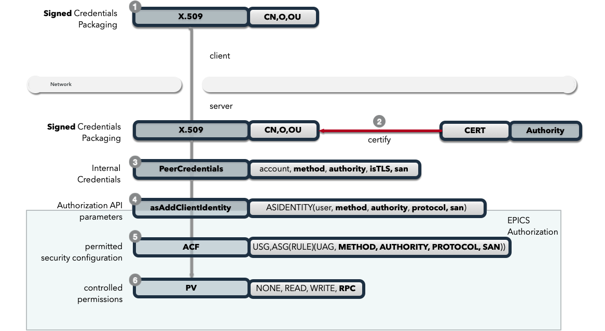

.. _authn_and_authz:

|security| Authentication
==========================

:ref:`Authentication and Authorization<glossary_auth_vs_authz>` with Secure PVAccess.
**Authentication** (AuthN) determines and verifies identity; **Authorization** (AuthZ) enforces access rights to PV resources.

Secure PVAccess enhances :ref:`epics_security` with fine-grained control based on:

- Authentication Mode
- Authentication Method
- Certifying Authority
- Protocol

.. _authentication_modes:

Authentication Modes
------------------------

- ``Mutual`` (mTLS — mutual TLS): Both client and server present X.509 certificates and
  authenticate each other during the TLS 1.3 handshake. The connection is fully
  encrypted and both identities are cryptographically verified. In SPVA access control,
  ``METHOD`` is ``x509``. This is the recommended mode for all production deployments.
- ``Server-only`` (TLS with anonymous client): Only the server presents a certificate;
  the client verifies the server but sends no client certificate. The channel is
  encrypted but only the server identity is authenticated. In SPVA, ``METHOD`` is
  ``ca`` or ``anonymous`` with ``PROTOCOL`` set to ``tls``.
- ``Un-authenticated`` (legacy channel): Credentials supplied in the PVAccess
  ``AUTHZ`` message over a plain TCP connection (no TLS). In SPVA, ``METHOD`` is
  ``ca``. Backward-compatible with Classic Channel Access / legacy PVA clients.
- ``Unknown`` (anonymous legacy): No credentials and no TLS. In SPVA, ``METHOD``
  is ``anonymous``.

.. _determining_identity:

Legacy Authentication Mode
^^^^^^^^^^^^^^^^^^^^^^^^^^^

Methods:

- ``anonymous`` - ``Unknown``
- ``ca`` - ``Un-authenticated``

.. image:: pvaident.png
   :alt: Identity in PVAccess
   :align: center

1. Optional ``AUTHZ`` message from client:

.. code-block:: shell

    AUTHZ method: ca
    AUTHZ user: george
    AUTHZ host: McInPro.level-n.com

2. Server uses PeerInfo structure:

- :ref:`peer_info`

3. PeerInfo fields map to `asAddClient()` parameters ...
4. for authorization through the ``ACF`` definitions of ``UAG`` and ``ASG`` ...
5. to control access to PVs

Secure PVAccess Authentication Mode
^^^^^^^^^^^^^^^^^^^^^^^^^^^^^^^^^^^^

Methods:

- server: ``x509`` / client: ``x509`` - ``Mutual``
- server: ``x509`` - ``Server-Only``

1. Client identity optionally established via X.509 certificate during TLS handshake:

.. code-block:: shell

    CN: greg
    O: SLAC.stanford.edu
    OU: SLAC National Accelerator Laboratory
    C: US

2. EPICS agent optionally verifies certificate via trust chain

3. PeerCredentials structure provides peer information:

- :ref:`peer_credentials`

4. Extended ``asAddClientIdentity()`` function provides

- :ref:`identity_structure`

5. Secure authorization control enhanced with:

- ``METHOD``
- ``AUTHORITY``
- ``PROTOCOL``

through the ACF definitions of ASGs ...

6. to control access to PVs

.. _site_authenticators:

Site Authenticators
--------------------

Authenticators generate certificates and place them in the PKCS#12 keychain file using credentials (tickets, tokens, or other identity-affirming data) from existing authentication methods. Command-line tools prefixed with ``authn`` (e.g., ``authnstd``) are the interfaces to these authenticators.

Reference Authenticators
^^^^^^^^^^^^^^^^^^^^^^^^^

.. _pvacms_type_0_auth_methods:

TYPE ``0`` - Basic Credentials
~~~~~~~~~~~~~~~~~~~~~~~~~~~~~~~

- Uses basic information:

  - CN: Common name

    - Commandline flag: ``-n`` ``--name``
    - Username

  - O: Organisation

    - Commandline flag: ``-o`` ``--organization``
    - Hostname
    - IP address

  - OU: Organisational Unit

    - Commandline flag: ``--ou``

  - C: Country

    - Commandline flag: ``-c`` ``--country``
    - Locale (not reliable)
    - Default = "US"

- No verification performed
- Certificates start in ``PENDING_APPROVAL`` state
- Requires administrator approval

.. _pvacms_type_1_auth_methods:

TYPE ``1`` - Independently Verifiable Tokens
~~~~~~~~~~~~~~~~~~~~~~~~~~~~~~~~~~~~~~~~~~~~~~

- Tokens verified independently or via endpoint
- Verification methods:

  - Token signature verification
  - Token payload validation
  - Verification endpoint calls

.. _pvacms_type_2_auth_methods:

TYPE ``2`` - Source Verifiable Tokens
~~~~~~~~~~~~~~~~~~~~~~~~~~~~~~~~~~~~~~

- Requires programmatic API integration (e.g., Kerberos)
- Adds verifiable data to :ref:`certificate_creation_request_CCR` message
- :ref:`pvacms` uses method-specific libraries for verification

Common Environment Variables for all Authenticators
^^^^^^^^^^^^^^^^^^^^^^^^^^^^^^^^^^^^^^^^^^^^^^^^^^^^

**Configuration options for Standard Authenticator**

+--------------------------------------------+------------------------------------+-----------------------------------------------------------------------+
| Name                                       | Keys and Values                    | Description                                                           |
+============================================+====================================+=======================================================================+
|| EPICS_PVA_AUTH_CERT_VALIDITY_MIN          || <number of minutes>               || Amount of minutes before the certificate expires.                    |
||                                           || e.g. ``1y`` for 1 year            || e.g. 1d or 1y 2w 1d or 24h                                           |
||                                           ||                                   || Where:                                                               |
||                                           ||                                   ||   1y = 365 days                                                      |
||                                           ||                                   ||   1M = 30 days                                                       |
||                                           ||                                   ||   1w = 7 days                                                        |
+--------------------------------------------+------------------------------------+-----------------------------------------------------------------------+
|| EPICS_PVA_AUTH_NAME                       || {name to use}                     || Name to use in new certificates                                      |
||                                           || e.g. ``archiver``                 ||                                                                      |
+--------------------------------------------+  e.g. ``IOC1``                     ||                                                                      |
|| EPICS_PVAS_AUTH_NAME                      || e.g. ``greg``                     ||                                                                      |
||                                           ||                                   ||                                                                      |
+--------------------------------------------+------------------------------------+-----------------------------------------------------------------------+
|| EPICS_PVA_AUTH_ORGANIZATION               || {organization to use}             || Organization to use in new certificates                              |
||                                           || e.g. ``site.epics.org``           ||                                                                      |
+--------------------------------------------+  e.g. ``SLAC.STANFORD.EDU``        ||                                                                      |
|| EPICS_PVAS_AUTH_ORGANIZATION              || e.g. ``KLYS:LI01:101``            ||                                                                      |
||                                           || e.g. ``centos07``                 ||                                                                      |
+--------------------------------------------+------------------------------------+-----------------------------------------------------------------------+
|| EPICS_PVA_AUTH_ORGANIZATIONAL_UNIT        || {organization unit to use}        || Organization Unit to use in new certificates                         |
||                                           || e.g. ``data center``              ||                                                                      |
+--------------------------------------------+  e.g. ``ops``                      ||                                                                      |
|| EPICS_PVAS_AUTH_ORGANIZATIONAL_UNIT       || e.g. ``prod``                     ||                                                                      |
||                                           || e.g. ``remote``                   ||                                                                      |
+--------------------------------------------+------------------------------------+-----------------------------------------------------------------------+
|| EPICS_PVA_AUTH_COUNTRY                    || {country to use}                  || Country to use in new certificates.                                  |
||                                           || e.g. ``US``                       || Must be a two digit country code                                     |
+--------------------------------------------+  e.g. ``CA``                       ||                                                                      |
|| EPICS_PVAS_AUTH_COUNTRY                   ||                                   ||                                                                      |
||                                           ||                                   ||                                                                      |
+--------------------------------------------+------------------------------------+-----------------------------------------------------------------------+
|| EPICS_PVA_AUTH_ISSUER                     || {issuer of cert. mgmt. service}   || The issuer ID to contact for any certificate operation.              |
||                                           || e.g. ``f0a9e1b8``                 || Must be am 8 character SKID                                          |
+--------------------------------------------+                                    ||                                                                      |
|| EPICS_PVAS_AUTH_ISSUER                    ||                                   || If there are PVACMS's from different certificate authorities         |
||                                           ||                                   || on the network, this allows you to specify the one you want          |
+--------------------------------------------+------------------------------------+-----------------------------------------------------------------------+
|| EPICS_PVA_CERT_PV_PREFIX                  || {certificate mgnt. prefix}        || Specify the prefix for the PVACMS PV to contact for new certificates |
||                                           || e.g. ``SLAC_CERTS``               || default ``CERT``                                                     |
+--------------------------------------------+                                    ||                                                                      |
|| EPICS_PVAS_CERT_PV_PREFIX                 ||                                   ||                                                                      |
||                                           ||                                   ||                                                                      |
+--------------------------------------------+------------------------------------+-----------------------------------------------------------------------+

Included Reference Authenticators
^^^^^^^^^^^^^^^^^^^^^^^^^^^^^^^^^^^^^^^^

PVXS provides three reference authenticator implementations:

- ``authnstd`` : Standard Authenticator - unverified credentials, TYPE ``0``
- ``authnkrb`` : Kerberos Authenticator - Kerberos credentials verified by the KDC, TYPE ``2``
- ``authnldap``: LDAP Authenticator - LDAP directory login for identity verification, TYPE ``2``

authstd Configuration and Usage
~~~~~~~~~~~~~~~~~~~~~~~~~~~~~~~~

``authnstd`` is a TYPE ``0`` authenticator using explicitly specified, unverified credentials.

- ``CN``: logged-in username, overridden by ``-n``/``--name`` or ``EPICS_PVA_AUTH_NAME``/``EPICS_PVAS_AUTH_NAME``
- ``O``: hostname or IP address, overridden by ``-o``/``--organization`` or ``EPICS_PVA_AUTH_ORGANIZATION``/``EPICS_PVAS_AUTH_ORGANIZATION``
- ``OU``: not set by default, overridden by ``--ou`` or ``EPICS_PVA_AUTH_ORGANIZATIONAL_UNIT``/``EPICS_PVAS_AUTH_ORGANIZATIONAL_UNIT``
- ``C``: local country code, overridden by ``-c``/``--country`` or ``EPICS_PVA_AUTH_COUNTRY``/``EPICS_PVAS_AUTH_COUNTRY``

.. _authnstd_prior_approval:

**Prior-approval inheritance**

Because ``authnstd`` carries no cryptographic identity proof, PVACMS cannot verify the
caller's identity independently. When PVACMS is configured to require administrator
approval for a certificate type, a fresh CCR from ``authnstd`` initially lands in
``PENDING_APPROVAL``.

However, PVACMS checks the database for the most recent certificate whose subject
(CN, O, OU, C) exactly matches the incoming request and reads its ``approved`` flag. If
a prior certificate for the same subject was previously approved by an administrator,
the new certificate inherits that approval and moves directly to ``VALID`` — no
administrator intervention is needed again.

This means:

- First issuance for a new subject → ``PENDING_APPROVAL`` (admin must approve once)
- Subsequent requests with the same subject (including daemon renewals via ``authnstd -D``)
  → automatically ``VALID``, inheriting the earlier approval

The match is purely on subject fields; a different public key (different SKID) for the
same subject still inherits the prior approval. If the prior certificate was **denied**
(``approved = 0``), the new request is also denied automatically.

**usage**

Uses the standard ``EPICS_PVA_TLS_<name>`` environment variables to determine the keychain and password file locations.

.. code-block:: shell

    authnstd - Secure PVAccess Standard Authenticator

    Generates client, server, or ioc certificates based on the Standard Authenticator.
    Uses specified parameters to create certificates that require administrator APPROVAL before becoming VALID.

    usage:
      authnstd [options]                         Create certificate in PENDING_APPROVAL state
      authnstd (-h | --help)                     Show this help message and exit
      authnstd (-V | --version)                  Print version and exit

    options:
      (-u | --cert-usage) <usage>                Specify the certificate usage.  client|server|ioc.  Default `client`
      (-n | --name) <name>                       Specify common name of the certificate. Default <logged-in-username>
      (-o | --organization) <organization>       Specify organisation name for the certificate. Default <hostname>
            --ou <org-unit>                      Specify organisational unit for the certificate. Default <blank>
      (-c | --country) <country>                 Specify country for the certificate. Default locale setting if detectable otherwise `US`
      (-t | --time) <minutes>                    Duration of the certificate in minutes.  e.g. 30 or 1d or 1y3M2d4m
            --san <type=value>                   Subject Alternative Name entry (repeatable, e.g. ip=10.0.0.1 or dns=ioc01.example.com)
            --server-san <type=value>            Server SAN entry (repeatable, for ioc usage)
            --schedule <day,HH:MM,HH:MM>         Validity schedule window (repeatable). day=0-6 (Sun-Sat) or *. Times are UTC
      (-D | --daemon)                            Start a renewal daemon (see Daemon Mode below)
            --cert-pv-prefix <cert_pv_prefix>     Specifies the pv prefix to use to contact PVACMS.  Default `CERT`
            --add-config-uri                      Add a config uri to the generated certificate
            --force                               Force overwrite if certificate exists
      (-a | --trust-anchor)                       Download Trust Anchor into keychain file.  Do not create a certificate
      (-s | --no-status)                          Request that status checking not be required for this certificate
      (-i | --issuer) <issuer_id>                 The issuer ID of the PVACMS service to contact.  If not specified (default) broadcast to any that are listening
      (-v | --verbose)                            Verbose mode
      (-d | --debug)                              Debug mode

**Examples**

.. code-block:: shell

    # create a client certificate for greg@slac.stanford.edu
    authnstd -u client -n greg -o slac.stanford.edu

.. code-block:: shell

    # create a server certificate for IOC1
    authnstd -u server -n IOC1 -o "KLI:LI01:10" --ou "FACET"

.. code-block:: shell

    # create a client certificate for current user with no status monitoring
    authnstd --no-status

.. code-block:: shell

    # create a ioc certificate for gateway1
    authnstd -u ioc -n gateway1 -o bridge.ornl.gov --ou "Networking"

.. code-block:: shell

    # Download the Trust Anchor into your keychain file for server-only authenticated connections
    authnstd --trust-anchor

.. _authn_daemon_mode:

Daemon Mode (``-D`` / ``--daemon``)
~~~~~~~~~~~~~~~~~~~~~~~~~~~~~~~~~~~~~

All three authenticators (``authnstd``, ``authnkrb``, ``authnldap``) support a
``-D`` / ``--daemon`` flag that turns the tool into a long-running renewal daemon.
Instead of requesting a certificate and exiting, the daemon:

1. **Issues a certificate** (or reuses an existing valid one from the keychain file)
   on startup, writing it to the keychain file as normal.
2. **Subscribes** to the certificate's ``CERT:STATUS`` PV using a plain-TCP inner
   PVA client (TLS disabled, so the subscription does not depend on the certificate
   it is managing).
3. **Watches for** the :ref:`renewal_due_hint` (``renewal_due = true``) published
   by PVACMS when the current time passes the midpoint between the last status-date
   and the ``renew_by`` deadline.
4. **Notifies PVACMS** when the hint arrives: submits a new CCR to PVACMS carrying
   fresh credentials (a new Kerberos service ticket, a new LDAP signature, etc.).
   **PVACMS performs the same full identity verification as on initial issuance** —
   it does not renew blindly. Only after verification passes does PVACMS look up an
   existing certificate with matching subject fields (CN, O, OU, C) that has
   ``renewal_due`` set in the database, and extend its ``renew_by`` deadline. The
   lookup is on subject fields, not on SKID or public key — the cryptographic
   assurance comes solely from the authenticator's ``verify()`` step.
   **No new certificate is issued and the keychain file is not overwritten.** The
   updated ``renew_by`` date is broadcast on the ``CERT:STATUS`` PV and posted to
   the ``CERT:CONFIG`` PV (see below). If verification fails — e.g. the Kerberos
   ticket has expired, or the LDAP account has been disabled — the CCR is rejected
   and the certificate will eventually enter ``PENDING_RENEWAL``.
5. **Retries** on failure: if the CCR fails (PVACMS unreachable, verification error,
   network error) the daemon logs an error and waits for the next ``renewal_due``
   update before retrying.
6. **Runs until interrupted** (``SIGINT`` / ``SIGTERM`` / ``Ctrl-C``).

**CERT:CONFIG PV**

While running, the daemon publishes a configuration PV at:

.. code-block:: text

    CERT:CONFIG:<issuer_id>:<skid>

where ``<issuer_id>`` is the first 8 hex digits of the CA's Subject Key Identifier
and ``<skid>`` is the SKID of the certificate being managed. The PV carries:

.. list-table::
   :widths: 20 12 68
   :header-rows: 1

   * - Field
     - Type
     - Description
   * - ``serial``
     - uint64
     - Serial number of the certificate (unchanged across renewals — the same
       certificate is extended, not replaced)
   * - ``issuer_id``
     - string
     - Issuer ID (CA SKID prefix)
   * - ``keychain``
     - string
     - Path to the keychain file being managed
   * - ``renew_by``
     - string
     - Human-readable UTC renewal deadline, updated each time PVACMS extends it

This PV lets operators and monitoring systems observe the daemon's current state
without reading the keychain file directly. Because renewal extends the existing
certificate rather than replacing it, the serial, issuer_id, and keychain path
never change after initial issuance — only ``renew_by`` is updated. The
``--add-config-uri`` flag embeds the ``CERT:CONFIG`` PV name in the certificate
itself (as the ``SPVA config uri`` X.509 extension) so that tools can discover
it from the certificate alone.

**Usage examples**

.. code-block:: shell

    # Run a client certificate renewal daemon for the current user
    # (blocks until interrupted; renews automatically when renewal_due fires)
    authnstd -D

.. code-block:: shell

    # Run an IOC certificate renewal daemon
    authnstd -D -u ioc -n ioc01 -o "SLAC" --ou "LCLS"

.. code-block:: shell

    # Kerberos renewal daemon (Kerberos ticket must already be valid)
    authnkrb -D -u ioc

.. code-block:: shell

    # LDAP renewal daemon
    authnldap -D -u client -n alice

**Typical IOC service configuration (systemd)**

.. code-block:: ini

    [Unit]
    Description=SPVA Certificate Renewal Daemon for IOC ioc01
    After=network.target

    [Service]
    ExecStart=/usr/bin/authnstd -D -u ioc -n ioc01 -o "SLAC" --ou "LCLS"
    Restart=on-failure
    RestartSec=30
    Environment=EPICS_PVAS_TLS_KEYCHAIN=/etc/pva/ioc01.p12
    Environment=EPICS_PVA_ADDR_LIST=pvacms.facility.org

    [Install]
    WantedBy=multi-user.target

.. _authn_daemon_verification:

Identity Verification on Every Renewal
~~~~~~~~~~~~~~~~~~~~~~~~~~~~~~~~~~~~~~~

PVACMS does **not** renew blindly. Every CCR submitted during a daemon renewal cycle
undergoes the same full identity verification as the original certificate request:

**Kerberos (``authnkrb -D``)**

  The CCR carries a fresh GSSAPI service ticket obtained from the current ticket cache.
  PVACMS verifies it against its keytab (confirming the ticket is valid with the KDC),
  checks the principal name matches the CCR subject, and verifies the MIC over the
  public key. The new ``renew_by`` deadline is capped to ``now + remaining_ticket_lifetime``
  — so the ``renew_by`` date directly tracks how much time is left on the Kerberos
  ticket. If the ticket has expired before ``renewal_due`` fires, verification fails and
  the certificate will enter ``PENDING_RENEWAL`` until a fresh ticket is available.

  Because the certificate ``renew_by`` date is tied to the ticket lifetime, Kerberos
  ticket auto-renewal and ``authnkrb -D`` form a natural pair: keeping the ticket alive
  automatically keeps the certificate alive. Standard Kerberos command-line options
  support this directly:

  .. code-block:: shell

      # Obtain an initial ticket with a maximum renewable lifetime of 7 days,
      # renewing it automatically every 10 hours in the background
      kinit -l 10h -r 7d -R greg@EPICS.ORG

      # Or use k5start to maintain the ticket cache continuously
      # (renews the ticket before it expires, restarts kinit if needed)
      k5start -f /etc/krb5.keytab -K 10 -u greg@EPICS.ORG

  In conjunction with ``authnkrb -D``, either approach produces a reliable, fully
  automated renewal loop: the Kerberos infrastructure renews the ticket, and the
  daemon uses each new ticket to extend the certificate ``renew_by`` date, with no
  manual intervention required.

**LDAP (``authnldap -D``)**

  The CCR carries the user's public key and a fresh signature over the CCR payload.
  PVACMS re-fetches the user's public key from the LDAP directory and verifies the
  signature. If the LDAP account has been disabled or the public key removed since the
  original issuance, verification fails and renewal is rejected. This makes LDAP
  revocation effective without waiting for the certificate to expire.

**Standard (``authnstd -D``)**

  The standard authenticator uses unverified credentials and carries no cryptographic
  identity proof. PVACMS therefore checks whether the subject (CN/O/OU/C) has ever
  been approved before. Specifically, it queries the database for the most recent
  certificate with the same subject fields and reads its ``approved`` flag. If that
  flag is set — meaning an administrator previously approved a certificate for this
  subject — the renewal CCR is automatically approved and the certificate returns to
  ``VALID`` immediately, without requiring administrator intervention again.

  This means that once an administrator approves a standard certificate, subsequent
  renewals from a daemon running with ``authnstd -D`` are silent and automatic,
  as long as the subject fields remain unchanged. If PVACMS is configured for
  auto-approval (``EPICS_PVACMS_CERT_CLIENT_REQUIRE_APPROVAL=NO`` etc.) the same
  applies to first issuance.

.. note::

   Daemon mode requires the certificate to have status monitoring enabled (the
   certificate must **not** be created with ``--no-status``). Without a ``CERT:STATUS``
   PV to subscribe to, the daemon cannot receive ``renewal_due`` notifications.

   For Kerberos daemons (``authnkrb -D``), the Kerberos ticket cache must remain valid
   when ``renewal_due`` fires. Use ``kinit -r`` with a long renewable lifetime, or a
   ticket-maintenance tool such as ``k5start`` or ``krenew``, to keep the ticket alive
   for the full intended daemon lifetime.

**Setup of standard authenticator in Docker Container for testing**

Source: ``/examples/docker/spva_std``

- users (unix)

  - ``pvacms`` - service
  - ``admin`` - principal with password "secret" (includes a configured PVACMS administrator certificate)
  - ``softioc`` - service principal with password "secret"
  - ``client`` - principal with password "secret"

- services

  - PVACMS

authkrb Configuration and Usage
~~~~~~~~~~~~~~~~~~~~~~~~~~~~~~~~

``authnkrb`` is a TYPE ``2`` authenticator. Certificates are generated from a Kerberos ticket obtained via ``kinit``.

.. code-block:: shell

    kinit -l 24h greg@SLAC.STANFORD.EDU

- ``CN``: Kerberos username
- ``O``: Kerberos realm
- ``OU``: not set
- ``C``: local country code

**Certificate lifetime and Kerberos ticket lifetime**

Kerberos tickets are typically short-lived (hours to a day). If the SPVA certificate
were issued with the same lifetime as the ticket, every ticket expiry would force
a full certificate replacement — and because TLS sessions are bound to a certificate,
every connected client would need to re-negotiate when the certificate changed. This
would make Kerberos-authenticated SPVA connections impractical for long-running IOC
or client processes.

The design avoids this by decoupling the two lifetimes:

- The **certificate ``not_after``** (hard expiry) is set to the PVACMS configured
  default (``EPICS_PVACMS_CERT_VALIDITY``, default 6 months). This is the outer
  bound on the certificate's life; connections remain valid as long as the
  certificate is ``VALID``, regardless of ticket state.

- The **certificate ``renew_by``** is capped by PVACMS to ``now + remaining_ticket_lifetime``
  at issuance time. This is the soft deadline: the certificate enters
  ``PENDING_RENEWAL`` if a renewal CCR has not arrived by this date.

The effect is that the **same certificate** is kept alive across multiple Kerberos
ticket cycles with no connection disruption. When ``renewal_due`` fires (at the
midpoint between the last status update and ``renew_by``), the daemon submits a
new CCR carrying a fresh ticket. PVACMS verifies the ticket, extends ``renew_by``
to ``now + new_ticket_lifetime``, and broadcasts the updated status — all without
issuing a new certificate or touching the keychain file.

.. code-block:: text

    ──────── certificate lifetime (e.g. 6 months) ────────────────────────────►
    │
    ├── issued ──────────── renew_by (ticket 1 expires) ──────── not_after ───►
    │                             │
    │                      renewal_due fires; fresh ticket sent
    │                      PVACMS extends renew_by to ticket 2 expiry
    │                             │
    │              ───────────────┴──── renew_by (ticket 2) ─────────────────►
    │                                         │
    │                                   renewal_due fires again; extends ──►
    │
    (same certificate, same TLS sessions, no reconnect required)

This makes ``authnkrb -D`` combined with a ticket auto-renewal tool the recommended
production deployment for Kerberos-authenticated IOCs and clients: the certificate
lifecycle is kept in step with the Kerberos identity lifecycle automatically, with
no downtime.

**usage**

Uses the standard ``EPICS_PVA_TLS_<name>`` environment variables to determine the keychain and password file locations.

.. code-block::

    authnkrb - Secure PVAccess Kerberos Authenticator

    Generates client, server, or ioc certificates based on the kerberos Authenticator.
    Uses current kerberos ticket to set the renewal date; certificate validity is set by PVACMS.

    usage:
      authnkrb [options]                         Create certificate
      authnkrb (-h | --help)                     Show this help message and exit
      authnkrb (-V | --version)                  Print version and exit

    options:
      (-u | --cert-usage) <usage>                Specify the certificate usage.  client|server|ioc.  Default ``client``
            --krb-validator <service-name>       Specify kerberos validator name.  Default ``pvacms``
            --krb-realm <krb-realm>              Specify the kerberos realm.  If not specified we'll take it from the ticket
      (-D | --daemon)                            Start a renewal daemon (see :ref:`authn_daemon_mode`)
            --cert-pv-prefix <cert_pv_prefix>    Specifies the pv prefix to use to contact PVACMS.  Default `CERT`
            --add-config-uri                     Add a config uri to the generated certificate
            --force                              Force overwrite if certificate exists
      (-s | --no-status)                         Request that status checking not be required for this certificate
      (-i | --issuer) <issuer_id>                The issuer ID of the PVACMS service to contact.  If not specified (default) broadcast to any that are listening
      (-v | --verbose)                           Verbose mode

**Extra options that are available in PVACMS**

.. code-block:: shell

    usage:
      pvacms [kerberos options]                  Run PVACMS.  Interrupt to quit

    kerberos options
            --krb-keytab <keytab file>           kerberos keytab file for non-interactive login`
            --krb-realm <realm>                  kerberos realm.  Default ``EPICS.ORG``
            --krb-validator <validator-service>  pvacms kerberos service name.  Default ``pvacms``

**Environment Variables for PVACMS AuthnKRB Verifier**

+----------------------+---------------------+--------------------------+----------------------+--------------------------------------+-----------------------------------------------------------------------+
| Env. *authnkrb*      | Env. *pvacms*       | Params. *authkrb*        | Params. *pvacms*     | Keys and Values                      | Description                                                           |
+======================+=====================+==========================+======================+======================================+=======================================================================+
||                     || KRB5_KTNAME        ||                         || ``--krb-keytab``    || {string location of keytab file}    || This is the keytab file shared with :ref:`pvacms` by the KDC so      |
||                     ||                    ||                         ||                     ||                                     || that it can verify kerberos tickets                                  |
||                     +---------------------+|                         ||                     ||                                     ||                                                                      |
||                     || KRB5_CLIENT_KTNAME ||                         ||                     ||                                     ||                                                                      |
||                     ||                    ||                         ||                     ||                                     ||                                                                      |
+----------------------+---------------------+--------------------------+----------------------+--------------------------------------+-----------------------------------------------------------------------+
|| EPICS_AUTH_KRB_VALIDATOR_SERVICE          || ``--krb-validator``                            || {this is validator service name}    || The name of the service user created in the KDC that the pvacms      |
||                                           ||                                                || e.g. ``pvacms``                     || service will log in as.  ``/cluster@{realm}`` will be added          |
+--------------------------------------------+-------------------------------------------------+--------------------------------------+-----------------------------------------------------------------------+
|| EPICS_AUTH_KRB_REALM                      || ``--krb-realm``                                || e.g. ``EPICS.ORG``                  || Kerberos REALM to authenticate against                               |
+--------------------------------------------+-------------------------------------------------+--------------------------------------+-----------------------------------------------------------------------+

**Setup of Kerberos in Docker Container for testing**

Source: ``/examples/docker/spva_krb``

- users (both unix and kerberos principals)

  - ``pvacms`` - service principal with private keytab file for authentication in ``~/.config/pva/1.5/pvacms.keytab``
  - ``admin`` - principal with password "secret" (includes a configured PVACMS administrator certificate)
  - ``softioc`` - service principal with password "secret"
  - ``client`` - principal with password "secret"

- services

  - KDC
  - kadmin Daemon
  - PVACMS

authldap Configuration and Usage
~~~~~~~~~~~~~~~~~~~~~~~~~~~~~~~~~

``authnldap`` is a TYPE ``2`` authenticator. Identity is established by logging in to the LDAP directory service.

- ``CN``: LDAP username
- ``O``: LDAP domain parts concatenated with "."
- ``OU``: not set
- ``C``: local country code

**usage**

Uses the standard ``EPICS_PVA_TLS_<name>`` environment variables to determine the keychain and password file locations.

.. code-block:: shell

    authnldap - Secure PVAccess LDAP Authenticator

    Generates client, server, or ioc certificates based on the LDAP credentials.

    usage:
      authnldap [options]                        Create certificate in PENDING_APPROVAL state
      authnldap (-h | --help)                    Show this help message and exit
      authnldap (-V | --version)                 Print version and exit

    options:
      (-u | --cert-usage) <usage>                Specify the certificate usage.  client|server|ioc.  Default `client`
      (-n | --name) <name>                       Specify LDAP username for common name in the certificate.
                                                 e.g. name ==> LDAP: uid=name, ou=People ==> Cert: CN=name
                                                 Default <logged-in-username>
      (-o | --organization) <organization>       Specify LDAP org for organization in the certificate.
                                                 e.g. epics.org ==> LDAP: dc=epics, dc=org ==> Cert: O=epics.org
                                                 Default <hostname>
      (-p | --password) <name>                   Specify LDAP password. If not specified will prompt for password
            --ldap-host <hostname>               LDAP server host
            --ldap-port <port>                   LDAP serever port
      (-D | --daemon)                            Start a renewal daemon (see :ref:`authn_daemon_mode`)
            --cert-pv-prefix <cert_pv_prefix>    Specifies the pv prefix to use to contact PVACMS.  Default `CERT`
            --add-config-uri                     Add a config uri to the generated certificate
            --force                              Force overwrite if certificate exists
      (-s | --no-status)                         Request that status checking not be required for this certificate
      (-i | --issuer) <issuer_id>                The issuer ID of the PVACMS service to contact.  If not specified (default) broadcast to any that are listening
      (-v | --verbose)                           Verbose mode
      (-d | --debug)                             Debug mode

**Extra options that are available in PVACMS**

.. code-block:: shell

    usage:
      pvacms [ldap options]                      Run PVACMS.  Interrupt to quit

    ldap options
            --ldap-host <host>                   LDAP Host.  Default localhost
            --ldap-port <port>                   LDAP port.  Default 389

**Environment Variables for authnldap and PVACMS AuthnLDAP Verifier**

+--------------------+--------------------------+--------------------------+--------------------------+---------------------------------------+------------------------------------------------------------+
| Env. *authnldap*   | Env. *pvacms*            | Params. *authldap*       | Params. *pvacms*         | Keys and Values                       | Description                                                |
+====================+==========================+==========================+==========================+=======================================+============================================================+
|| EPICS_AUTH_LDAP   ||                         ||                         ||                         || {location of password file}          || file containing password for the given LDAP user account  |
|| _ACCOUNT_PWD_FILE ||                         ||                         ||                         || e.g. ``~/.config/pva/1.5/ldap.pass`` ||                                                           |
+--------------------+--------------------------+--------------------------+--------------------------+---------------------------------------+------------------------------------------------------------+
||                   ||                         || ``-p``                  ||                         || {LDAP account password}              || password for the given LDAP user account                  |
||                   ||                         || ``--password``          ||                         || e.g. ``secret``                      ||                                                           |
+--------------------+--------------------------+--------------------------+--------------------------+---------------------------------------+------------------------------------------------------------+
|| EPICS_AUTH_LDAP_HOST                         ||                                                    || {hostname of LDAP server}            || Trusted hostname of the LDAP server                       |
||                                              || ``--ldap-host``                                    || e.g. ``ldap.stanford.edu``           ||                                                           |
+-----------------------------------------------+-----------------------------------------------------+---------------------------------------+------------------------------------------------------------+
|| EPICS_AUTH_LDAP_PORT                         ||                                                    || <port_number>                        || LDAP server port number. Default is 389                   |
||                                              || ``--ldap-port``                                    || e.g. ``389``                         ||                                                           |
+-----------------------------------------------+-----------------------------------------------------+---------------------------------------+------------------------------------------------------------+

**Setup of LDAP in Docker Container for testing**

Source: ``/examples/docker/spva_ldap``

- users (both unix and LDAP users)

  - ``pvacms`` - service with verifier for LDAP service
  - ``admin`` - principal with password "secret" (includes a configured PVACMS administrator certificate)
  - ``softioc`` - service principal with password "secret"
  - ``client`` - principal with password "secret"

- services

  - LDAP service + example schemas
  - PVACMS

.. _epics_security:

Certificate Lifetime and Renewal
----------------------------------

TLS 1.3 removes session renegotiation entirely. Once a mTLS connection is established
with an IOC over Secure PVAccess, the certificate cannot be swapped without breaking
the connection. The SPVA design addresses this with two complementary mechanisms:

- **Long certificate validity** (months to years) — so the X.509 hard expiry
  (``not_after``) rarely forces a connection drop.
- **Soft renewal via** ``renew_by`` — a separate deadline, set by the authenticator,
  that triggers a proactive renewal CCR *before* the certificate's hard expiry. The
  same certificate continues in use throughout; no reconnect is needed.

.. _cert_duration:

Specifying Certificate Duration
^^^^^^^^^^^^^^^^^^^^^^^^^^^^^^^^^

All authenticators accept a ``-t`` / ``--time`` flag (or ``EPICS_AUTH_CERT_VALIDITY_MINS``
environment variable) to request a specific validity period. Duration strings use
combined components:

- ``y`` — years, ``M`` — months, ``w`` — weeks, ``d`` — days,
  ``h`` — hours, ``m`` — minutes, ``s`` — seconds

Examples: ``30`` (minutes), ``1d``, ``6M``, ``1y6M``, ``2y3M15d``.

Duration calculations account for daylight saving, leap years, and calendar
boundaries. PVACMS may override the requested duration if a default or maximum
is configured (see below).

PVACMS can set default validity and prevent clients from requesting custom
durations:

.. list-table::
   :widths: 50 50
   :header-rows: 1

   * - CLI flag
     - Environment variable
   * - ``--cert-validity <duration>``
     - ``EPICS_PVACMS_CERT_VALIDITY``
   * - ``--cert-validity-client <duration>``
     - ``EPICS_PVACMS_CERT_VALIDITY_CLIENT``
   * - ``--cert-validity-server <duration>``
     - ``EPICS_PVACMS_CERT_VALIDITY_SERVER``
   * - ``--cert-validity-ioc <duration>``
     - ``EPICS_PVACMS_CERT_VALIDITY_IOC``
   * - ``--disallow-custom-durations``
     - ``EPICS_PVACMS_DISALLOW_CUSTOM_DURATION=YES``
   * - ``--disallow-custom-durations-client``
     - ``EPICS_PVACMS_DISALLOW_CLIENT_CUSTOM_DURATION=YES``
   * - ``--disallow-custom-durations-server``
     - ``EPICS_PVACMS_DISALLOW_SERVER_CUSTOM_DURATION=YES``
   * - ``--disallow-custom-durations-ioc``
     - ``EPICS_PVACMS_DISALLOW_IOC_CUSTOM_DURATION=YES``

The PVACMS default is **6 months** for all certificate types.

.. _cert_renewal_by:

The ``renew_by`` Date — How It Is Set
^^^^^^^^^^^^^^^^^^^^^^^^^^^^^^^^^^^^^^^

Every authenticated CCR carries two dates: the requested ``not_after``
(hard expiry) and an **authenticated expiration** set by the authenticator's
``verify()`` call on the PVACMS side. PVACMS uses the authenticated expiration
as the ``renew_by`` date (capped to ``not_after`` if it would otherwise exceed it):

- **Standard authenticator**: No independent identity proof, so ``renew_by`` is not
  set by default (the certificate is valid until ``not_after``). If ``--time``
  is specified and is shorter than ``not_after``, it becomes ``renew_by``.
- **Kerberos** (``authnkrb``): PVACMS verifies the GSSAPI service ticket and sets
  ``renew_by = now + remaining_ticket_lifetime``. A typical ticket lasts 8–24 hours,
  so the certificate is renewed daily, but the underlying X.509 certificate (and all
  mTLS connections using it) remains valid for the full PVACMS-configured duration
  (e.g. 6 months). See :ref:`authnkrb_lifetime` for the full design rationale.
- **LDAP** (``authnldap``): The ``renew_by`` date is taken from the requested
  ``not_after``; LDAP does not impose an independent authenticated lifetime.

.. _cert_renewal_enforcement:

How ``renew_by`` Is Enforced
^^^^^^^^^^^^^^^^^^^^^^^^^^^^^^

All certificates with a ``renew_by`` date require certificate status monitoring
(``--no-status`` and ``renew_by`` are mutually exclusive). The status monitor
enforces the deadline as follows:

1. While ``now < renew_by``: certificate status is ``VALID``.
2. At the midpoint between the last status update and ``renew_by``: PVACMS posts
   ``renewal_due = true`` on the ``CERT:STATUS`` PV as a proactive hint (see
   :ref:`renewal_due_hint`). The certificate remains ``VALID``.
3. If ``now >= renew_by`` and no renewal CCR has arrived: status transitions to
   ``PENDING_RENEWAL``. The context enters ``TcpOnly``: no new TLS connections are
   accepted/initiated, but **existing mTLS connections remain open**.
4. When a valid renewal CCR arrives: PVACMS extends ``renew_by``, transitions back
   to ``VALID``, and broadcasts the update on ``CERT:STATUS``. Existing and new TLS
   connections resume immediately.

.. _cert_renewing:

Renewing a Certificate
^^^^^^^^^^^^^^^^^^^^^^^^

To renew, repeat the same authenticator command used for initial issuance — or use
the :ref:`authn_daemon_mode` (``-D`` flag) to have the renewal happen automatically.
PVACMS recognises a renewal by matching on the certificate subject fields
(CN, O, OU, C) combined with the ``renewal_due`` flag being set in the database.
**No new X.509 certificate is issued and the keychain file is not modified.**
The same certificate continues to be used by all active connections.

.. note::

   The renewal lookup matches on **subject fields only** (CN/O/OU/C), not on the
   SKID or public key. This means a CCR from a different key pair but with the same
   subject would also match. The cryptographic assurance that only the legitimate
   holder can renew comes from the **authenticator's identity verification** on the
   CCR — the Kerberos GSSAPI token for ``authnkrb``, the LDAP public-key signature
   for ``authnldap`` — not from a key-match check. For ``authnstd`` there is no
   cryptographic proof; security relies on network-level access controls and the
   requirement that ``renewal_due`` was set by PVACMS (not the client).

Key properties of renewal:

- Identity is **re-verified** by PVACMS on every renewal CCR (see
  :ref:`authn_daemon_verification`) — renewal is never blind.
- The ``renew_by`` date is extended to ``now + new_authenticated_lifetime``.
- For Kerberos, this tracks the new ticket's remaining lifetime.
- For standard authenticator, prior-approval is inherited automatically (see
  :ref:`authnstd_prior_approval`).
- Multiple successive renewals are supported; there is no limit on renewal count.

.. _authnkrb_lifetime:

.. rubric:: Kerberos: certificate lifetime longer than the ticket

See :ref:`the full explanation in the authnkrb section <authn_daemon_verification>`
for how ``not_after`` (long PVACMS default) and ``renew_by`` (ticket lifetime) are
deliberately decoupled to avoid connection disruption.
