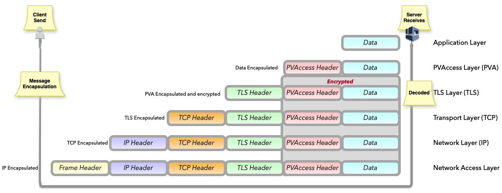
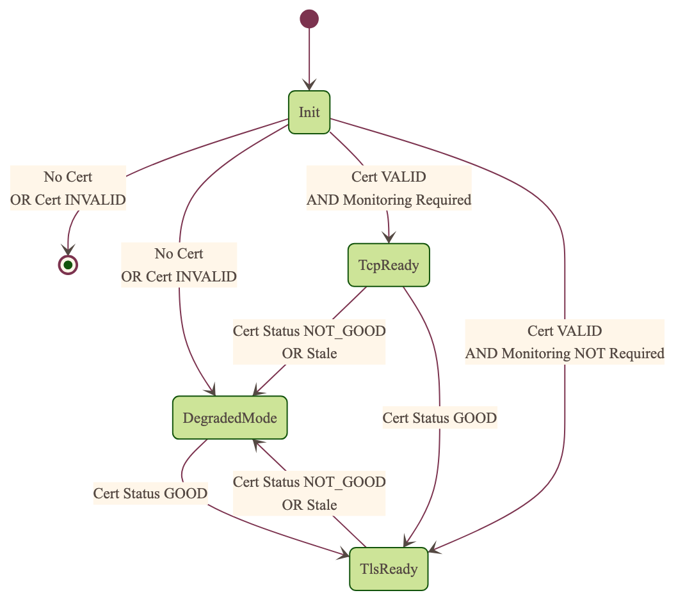

.. _secure_pvaccess_detail:

|security| Secure PVAccess
============================

.. _transport_layer_security:

Transport Layer Security
------------------------

SPVA secures PVAccess connections using TLS 1.3. Both peers may authenticate via X.509 certificates.
TLS 1.3 enforces a minimum protocol version (``SSL_CTX_set_min_proto_version(TLS1_3_VERSION)``) and
deprecates connection renegotiation. Connections are closed rather than renegotiated when a certificate
is revoked or requires renewal.

Three connection modes are supported:

- ``tcp/tcp``: TCP only (legacy ``ca``)
- ``tcp/tls``: server-only authenticated TLS
- ``tls/tls``: mutually authenticated TLS

Supported Keychain-File Formats
^^^^^^^^^^^^^^^^^^^^^^^^^^^^^^^^

+-----------+----------------------+-----------+-------------------------+------------------------------+-------------------------+
| File Type | Extension            | Encoding  | Includes Private Key?   | Includes Certificate Chain?  |     Common Usage        |
+===========+======================+===========+=========================+==============================+=========================+
|| PKCS#12  || ``.p12``, ``.pfx``  || Binary   || Optional (password)    || Yes                         || Distributing cert key  |
+-----------+----------------------+-----------+-------------------------+------------------------------+-------------------------+

Unsupported Certificate Formats
^^^^^^^^^^^^^^^^^^^^^^^^^^^^^^^^

+-----------+----------------------+-----------+-------------------------+------------------------------+-------------------------+
| File Type | Extension            | Encoding  | Includes Private Key?   | Includes Certificate Chain?  |     Common Usage        |
+===========+======================+===========+=========================+==============================+=========================+
|| PEM      || ``.pem``, ``.crt``, || Base64   || Optional               || Optional (concatenated)     || Web servers, OpenSSL   |
||          || ``.cer``, ``.key``  ||          ||                        ||                             ||                        |
+-----------+----------------------+-----------+-------------------------+------------------------------+-------------------------+
|| JKS      || ``.jks``            || Binary   || Optional               || Yes                         || Java applications      |
+-----------+----------------------+-----------+-------------------------+------------------------------+-------------------------+

TLS Encapsulation
^^^^^^^^^^^^^^^^^

PVAccess messages are encapsulated within TLS 1.3 records. Each record carries a content type,
protocol version, length header, and the encrypted PVAccess payload.

.. _protocol_operation:

Protocol Operation
------------------

.. _connection_establishment:

Connection Establishment
^^^^^^^^^^^^^^^^^^^^^^^^

TLS is used when at least the server is configured for TLS. PKCS#12 keychain files are loaded via
``IdFileReader``, which extracts the certificate, CA chain, and private key. Key usage is validated:
clients require ``XKU_SSL_CLIENT``; servers require ``XKU_SSL_SERVER``. Certificate chain verification
depth is limited to 5 levels. The ALPN protocol identifier is ``pva/1``.

An agent uses TLS if a certificate, trust anchor, and private key are present at the path given by
``EPICS_PVA_TLS_KEYCHAIN``. Default paths:

- ``~/.config/pva/1.4/client.p12`` for clients
- ``~/.config/pva/1.4/server.p12`` for servers

For server-only authenticated TLS:

- The server must set ``EPICS_PVA_TLS_OPTIONS`` option ``client_cert`` to ``optional``.
- The client must have a keychain file containing a trust anchor at ``EPICS_PVA_TLS_KEYCHAIN``.
  This file can be created using ``authnstd -t``.

Prior to the TLS handshake, certificates are loaded and validated, CA trust chains are verified,
and certificate status subscriptions are established and cached for all certificates in the chain.
During the handshake, certificates are exchanged, servers staple cached status, and both peers
validate against their trusted root. After the handshake, both peers subscribe to peer certificate
status; clients may use stapled server status.

.. _state_machines:

State Machines
^^^^^^^^^^^^^^

*Server TLS Context State Machine:*

States: ``Init``, ``TlsReady``, ``DegradedMode``.

- ``Init``: initial state; loads and validates certificates. The context remains in ``Init``
  until cert-status resolution completes.
- ``TlsReady``: certificate status is ``GOOD``; both TCP and TLS protocol requests are served.
- ``DegradedMode``: certificate is permanently invalid (``REVOKED`` or ``EXPIRED``). Only TCP
  is permitted. The certificate monitor is stopped.

Transitions are driven by certificate validity, status monitoring results, and :ref:`configuration` options.

*Client TLS Context State Machine:*

States are the same as the server (``Init``, ``TlsReady``, ``DegradedMode``). The client never
exits on TLS configuration issues; trust anchor validation and certificate status govern
initial transitions.

.. image:: /_images/spva_client_tls_context.png
   :alt: SPVA Client TLS Context State Machine
   :align: center

*Peer Certificate Status State Machine:*

Applies to both clients and servers.

Status classes (internal grouping of PVACMS status values):

- ``UNKNOWN``: status not yet received or indeterminate. Connections wait; operations are
  not yet permitted.
- ``GOOD``: certificate status is ``VALID``. TLS proceeds normally.
- ``BAD``: certificate is permanently invalid (``REVOKED`` or ``EXPIRED``). Connection is
  torn down immediately; no recovery.

Pseudo-states (terminal or immediate):

- ``STALE``: status validity period has elapsed; transitions immediately to ``UNKNOWN``.

Transitions are driven by status updates from :ref:`pvacms` and PVACMS availability.

.. note::

   Subscription to permanent-terminal statuses (``REVOKED`` / ``EXPIRED``) is suppressed:
   once a peer status is confirmed as ``BAD`` and the connection has been torn down, pvxs
   does not re-subscribe to that certificate's status PV on subsequent connections to the same
   peer. This avoids burning PVACMS channels on certificates that cannot recover.

Certificate status values from PVACMS: ``UNKNOWN``, ``VALID``, ``PENDING``, ``PENDING_APPROVAL``,
``EXPIRED``, ``REVOKED``.
OCSP status values: ``GOOD``, ``REVOKED``, ``UNKNOWN``.

.. image:: /_images/spva_peer_certificate_status.png
   :alt: SPVA Peer Certificate Status State Machine
   :align: center

.. _tls_handshake:

PVAccess Sequence Diagram
~~~~~~~~~~~~~~~~~~~~~~~~~

.. image:: /_images/pva_seq.png
   :alt: PVA Sequence Diagram
   :align: center

Secure PVAccess Sequence Diagram
~~~~~~~~~~~~~~~~~~~~~~~~~~~~~~~~~

.. image:: /_images/spva_simple_seq.png
   :alt: SPVA Sequence Diagram
   :align: center

Click for a detailed diagram `with <_images/h_spva_seq.png>`_
or `without <_images/h_tls_seq.png>`_ certificate status monitoring

Each agent presents an X.509 certificate verified against its own trust anchor (stored in the same
keychain file). Verification covers signature, expiration, usage flags, and up to 5 chain levels.
If the certificate carries a status monitoring extension, the agent subscribes to status updates
from :ref:`pvacms` and caches the result. During the handshake, peer certificates undergo the same
verification. Servers staple their cached status; clients may consume stapled status in lieu of an
initial :ref:`pvacms` request. A ``GOOD`` status from PVACMS is required before trust is granted.

.. _status_verification:

Certificate Status Verification
^^^^^^^^^^^^^^^^^^^^^^^^^^^^^^^^

PVACMS returns ``GOOD`` for a certificate only when the certificate itself is good and every
certificate in its trust anchor chain back to the root is also good. Agents therefore need only
monitor their own entity certificate and their peer's entity certificate.

Status response handling:

- Status not yet received (``UNKNOWN``): search requests are ignored; the client retries later.
- Status ``BAD`` (``REVOKED`` / ``EXPIRED``): the server offers only TCP; the client tears down
  the connection immediately.
- Status ``GOOD`` (``VALID``): the server offers both TCP and TLS; the connection proceeds.

**Pre-Validated connection give-up.** When a TLS connection has completed the handshake but
has not yet completed secure channel admission (the "pre-Validated" state), the first
authoritative cert-status delivery for either the local cert or the peer cert drives a
deterministic exit:

- ``GOOD``: the admission gate releases and the channel completes over TLS (happy path).
- ``BAD`` class (own cert): the context enters ``DegradedMode``; all pre-Validated TLS
  connections are torn down. Channels fall back to TCP.
- ``BAD`` class (peer cert): the specific pre-Validated connection is torn down. The client
  returns the channel to searching; the server drops the connection.

This ensures no pre-Validated TLS connection waits indefinitely for a status that will not
become ``GOOD`` on the current connection attempt.

.. _status_caching:

Status Caching
^^^^^^^^^^^^^^

Agents subscribe to peer certificate status via :ref:`pvacms`. Status transitions trigger
connection re-evaluation. The most recent status is held in memory for the lifetime of the
subscription and reused within its validity period. Servers staple their cached status during
the TLS handshake; clients may consume stapled status in lieu of an initial :ref:`pvacms`
request.

In non-OpenSSL builds, all cache operations are no-ops.

Beacons
^^^^^^^

PVAccess Beacon Messages have not been upgraded to TLS support. Beacons remain unencrypted and
contain no sensitive information. They serve only as a server availability indicator. Clients must
not use beacon ports directly, and must not rely on beacons for secure discovery.

.. _protocol_debugging:

Protocol Debugging
------------------

TLS Packet Inspection
^^^^^^^^^^^^^^^^^^^^^

TLS key logging requires the ``PVXS_ENABLE_SSLKEYLOGFILE`` compile-time flag. At runtime:

.. code-block:: shell

    export SSLKEYLOGFILE=/tmp/sslkeylog.log

In Wireshark: Edit > Preferences > Protocols > TLS, set "(Pre)-Master-Secret log filename" to the
``SSLKEYLOGFILE`` path.

Debug Logging
^^^^^^^^^^^^^

.. code-block:: shell

    export PVXS_LOG="pvxs.stapling*=DEBUG"

Debug log categories:

- ``pvxs.certs.auth``          - Authenticators
- ``pvxs.auth.cfg``            - Authn configuration
- ``pvxs.auth.cms``            - CMS
- ``pvxs.auth.krb``            - Kerberos Authenticator
- ``pvxs.auth.mon``            - Certificate Status Monitoring
- ``pvxs.auth.stat``           - Certificate Status
- ``pvxs.auth.std``            - Standard Authenticator
- ``pvxs.auth.tool``           - Certificate Management Tools (``pvacert``)
- ``pvxs.certs.status``        - Certificate Status Management
- ``pvxs.ossl.init``           - TLS initialization
- ``pvxs.ossl.io``             - TLS I/O
- ``pvxs.stapling``            - OCSP stapling

.. _network_deployment:

Network Deployment
------------------

Deployment Patterns
^^^^^^^^^^^^^^^^^^^

Three deployment patterns are supported:

- **Standard**: agents on networked hosts with local storage; certificates in local protected directories.
- **Diskless**: agents on hosts without local storage; certificates on network-mounted storage (NFS, SMB/CIFS, AFP) with optional password protection via diskless server.
- **Hybrid**: mix of standard and diskless nodes sharing a common trust anchor with consistent :ref:`certificate_management`.

Keychain-File Storage
^^^^^^^^^^^^^^^^^^^^^

Keychain file paths follow the `XDG_CONFIG_HOME <https://specifications.freedesktop.org/basedir-spec/latest/>`_
standard. When ``XDG_CONFIG_HOME`` is unset, it defaults to ``~/.config``. The full default path is
``~/.config/pva/1.4/``, with ``client.p12`` for clients and ``server.p12`` for servers.

Each keychain file contains the certificate, private key, and CA chain including the root certificate.
Files are protected with mode ``400``. The agent reconfigures automatically on certificate updates.

Trust Establishment
^^^^^^^^^^^^^^^^^^^

Administrators distribute PKCS#12 files containing the Root CA certificate to all clients, stored at
the path given by ``EPICS_PVA_TLS_KEYCHAIN``. These files are replaced when new entity certificates
are generated, but the trust anchor certificate is preserved. Publicly signed trust anchor certificates
are not supported.

When using authenticators, the trust anchor is delivered with the entity certificate. Users must verify
that the certificate issuer matches the expected Root CA. The PVACMS service selection, and thus the
trust anchor, is controlled by:

- ``EPICS_PVA_ADDR_LIST``
- ``EPICS_PVA_AUTO_ADDR_LIST``

To retrieve the trust anchor certificate from PVACMS:

.. code-block:: shell

    # Save to the location specified by EPICS_PVA_TLS_KEYCHAIN
    authnstd --trust-anchor

    # Save to the location specified by EPICS_PVAS_TLS_KEYCHAIN
    authnstd -u server -a

:ref:`pvacms` acts as the site Certificate Authority and trust anchor for all nodes, handling the
full certificate lifecycle.
