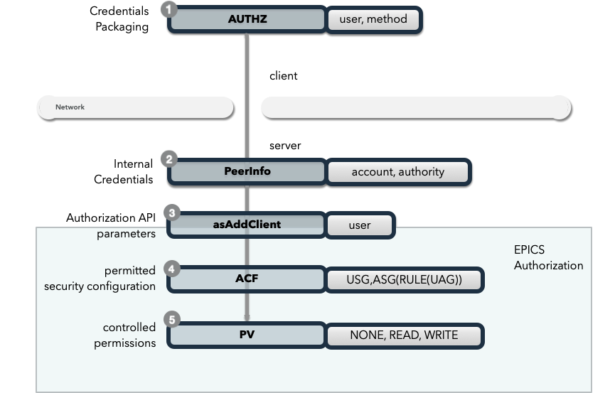

.. _authn_and_authz:

|security| Authentication
==========================

:ref:`Authentication and Authorization<glossary_auth_vs_authz>` with Secure PVAccess.
**Authentication** (AuthN) determines and verifies identity; **Authorization** (AuthZ) enforces access rights to PV resources.

Secure PVAccess enhances :ref:`epics_security` with fine-grained control based on:

- Authentication Mode
- Authentication Method
- Certifying Authority
- Protocol

.. _authentication_modes:

Authentication Modes
------------------------

- ``Mutual``: Both client and server authenticated via certificates (spva: ``METHOD`` is ``x509``)
- ``Server-only``: Only server authenticated via certificate (spva: ``METHOD`` is ``ca`` or ``anonymous``, ``PROTOCOL`` is ``tls``)
- ``Un-authenticated``: Credentials supplied in ``AUTHZ`` message (legacy: ``METHOD`` is ``ca``)
- ``Unknown``: No credentials (legacy: ``METHOD`` is ``anonymous``)

.. _determining_identity:

Legacy Authentication Mode
^^^^^^^^^^^^^^^^^^^^^^^^^^^

Methods:

- ``anonymous`` - ``Unknown``
- ``ca`` - ``Un-authenticated``

1. Optional ``AUTHZ`` message from client:

.. code-block:: shell

    AUTHZ method: ca
    AUTHZ user: george
    AUTHZ host: McInPro.level-n.com

2. Server uses PeerInfo structure:

- :ref:`peer_info`

3. PeerInfo fields map to `asAddClient()` parameters ...
4. for authorization through the ``ACF`` definitions of ``UAG`` and ``ASG`` ...
5. to control access to PVs

Secure PVAccess Authentication Mode
^^^^^^^^^^^^^^^^^^^^^^^^^^^^^^^^^^^^

Methods:

- server: ``x509`` / client: ``x509`` - ``Mutual``
- server: ``x509`` - ``Server-Only``

.. image:: spvaident.png
   :alt: Identity in Secure PVAccess
   :align: center

1. Client identity optionally established via X.509 certificate during TLS handshake:

.. code-block:: shell

    CN: greg
    O: SLAC.stanford.edu
    OU: SLAC National Accelerator Laboratory
    C: US

2. EPICS agent optionally verifies certificate via trust chain

3. PeerCredentials structure provides peer information:

- :ref:`peer_credentials`

4. Extended ``asAddClientIdentity()`` function provides

- :ref:`identity_structure`

5. Secure authorization control enhanced with:

- ``METHOD``
- ``AUTHORITY``
- ``PROTOCOL``

through the ACF definitions of ASGs ...

6. to control access to PVs

.. _site_authenticators:

Site Authenticators
--------------------

Authenticators generate certificates and place them in the PKCS#12 keychain file using credentials (tickets, tokens, or other identity-affirming data) from existing authentication methods. Command-line tools prefixed with ``authn`` (e.g., ``authnstd``) are the interfaces to these authenticators.

Reference Authenticators
^^^^^^^^^^^^^^^^^^^^^^^^^

.. _pvacms_type_0_auth_methods:

TYPE ``0`` - Basic Credentials
~~~~~~~~~~~~~~~~~~~~~~~~~~~~~~~

- Uses basic information:

  - CN: Common name

    - Commandline flag: ``-n`` ``--name``
    - Username

  - O: Organisation

    - Commandline flag: ``-o`` ``--organization``
    - Hostname
    - IP address

  - OU: Organisational Unit

    - Commandline flag: ``--ou``

  - C: Country

    - Commandline flag: ``-c`` ``--country``
    - Locale (not reliable)
    - Default = "US"

- No verification performed
- Certificates start in ``PENDING_APPROVAL`` state
- Requires administrator approval

.. _pvacms_type_1_auth_methods:

TYPE ``1`` - Independently Verifiable Tokens
~~~~~~~~~~~~~~~~~~~~~~~~~~~~~~~~~~~~~~~~~~~~~~

- Tokens verified independently or via endpoint
- Verification methods:

  - Token signature verification
  - Token payload validation
  - Verification endpoint calls

.. _pvacms_type_2_auth_methods:

TYPE ``2`` - Source Verifiable Tokens
~~~~~~~~~~~~~~~~~~~~~~~~~~~~~~~~~~~~~~

- Requires programmatic API integration (e.g., Kerberos)
- Adds verifiable data to :ref:`certificate_creation_request_CCR` message
- :ref:`pvacms` uses method-specific libraries for verification

Common Environment Variables for all Authenticators
^^^^^^^^^^^^^^^^^^^^^^^^^^^^^^^^^^^^^^^^^^^^^^^^^^^^

**Configuration options for Standard Authenticator**

+--------------------------------------------+------------------------------------+-----------------------------------------------------------------------+
| Name                                       | Keys and Values                    | Description                                                           |
+============================================+====================================+=======================================================================+
|| EPICS_PVA_AUTH_CERT_VALIDITY_MIN          || <number of minutes>               || Amount of minutes before the certificate expires.                    |
||                                           || e.g. ``1y`` for 1 year            || e.g. 1d or 1y 2w 1d or 24h                                           |
||                                           ||                                   || Where:                                                               |
||                                           ||                                   ||   1y = 365 days                                                      |
||                                           ||                                   ||   1M = 30 days                                                       |
||                                           ||                                   ||   1w = 7 days                                                        |
+--------------------------------------------+------------------------------------+-----------------------------------------------------------------------+
|| EPICS_PVA_AUTH_NAME                       || {name to use}                     || Name to use in new certificates                                      |
||                                           || e.g. ``archiver``                 ||                                                                      |
+--------------------------------------------+  e.g. ``IOC1``                     ||                                                                      |
|| EPICS_PVAS_AUTH_NAME                      || e.g. ``greg``                     ||                                                                      |
||                                           ||                                   ||                                                                      |
+--------------------------------------------+------------------------------------+-----------------------------------------------------------------------+
|| EPICS_PVA_AUTH_ORGANIZATION               || {organization to use}             || Organization to use in new certificates                              |
||                                           || e.g. ``site.epics.org``           ||                                                                      |
+--------------------------------------------+  e.g. ``SLAC.STANFORD.EDU``        ||                                                                      |
|| EPICS_PVAS_AUTH_ORGANIZATION              || e.g. ``KLYS:LI01:101``            ||                                                                      |
||                                           || e.g. ``centos07``                 ||                                                                      |
+--------------------------------------------+------------------------------------+-----------------------------------------------------------------------+
|| EPICS_PVA_AUTH_ORGANIZATIONAL_UNIT        || {organization unit to use}        || Organization Unit to use in new certificates                         |
||                                           || e.g. ``data center``              ||                                                                      |
+--------------------------------------------+  e.g. ``ops``                      ||                                                                      |
|| EPICS_PVAS_AUTH_ORGANIZATIONAL_UNIT       || e.g. ``prod``                     ||                                                                      |
||                                           || e.g. ``remote``                   ||                                                                      |
+--------------------------------------------+------------------------------------+-----------------------------------------------------------------------+
|| EPICS_PVA_AUTH_COUNTRY                    || {country to use}                  || Country to use in new certificates.                                  |
||                                           || e.g. ``US``                       || Must be a two digit country code                                     |
+--------------------------------------------+  e.g. ``CA``                       ||                                                                      |
|| EPICS_PVAS_AUTH_COUNTRY                   ||                                   ||                                                                      |
||                                           ||                                   ||                                                                      |
+--------------------------------------------+------------------------------------+-----------------------------------------------------------------------+
|| EPICS_PVA_AUTH_ISSUER                     || {issuer of cert. mgmt. service}   || The issuer ID to contact for any certificate operation.              |
||                                           || e.g. ``f0a9e1b8``                 || Must be am 8 character SKID                                          |
+--------------------------------------------+                                    ||                                                                      |
|| EPICS_PVAS_AUTH_ISSUER                    ||                                   || If there are PVACMS's from different certificate authorities         |
||                                           ||                                   || on the network, this allows you to specify the one you want          |
+--------------------------------------------+------------------------------------+-----------------------------------------------------------------------+
|| EPICS_PVA_CERT_PV_PREFIX                  || {certificate mgnt. prefix}        || Specify the prefix for the PVACMS PV to contact for new certificates |
||                                           || e.g. ``SLAC_CERTS``               || default ``CERT``                                                     |
+--------------------------------------------+                                    ||                                                                      |
|| EPICS_PVAS_CERT_PV_PREFIX                 ||                                   ||                                                                      |
||                                           ||                                   ||                                                                      |
+--------------------------------------------+------------------------------------+-----------------------------------------------------------------------+

Included Reference Authenticators
^^^^^^^^^^^^^^^^^^^^^^^^^^^^^^^^^^^^^^^^

PVXS provides three reference authenticator implementations:

- ``authnstd`` : Standard Authenticator - unverified credentials, TYPE ``0``
- ``authnkrb`` : Kerberos Authenticator - Kerberos credentials verified by the KDC, TYPE ``2``
- ``authnldap``: LDAP Authenticator - LDAP directory login for identity verification, TYPE ``2``

authstd Configuration and Usage
~~~~~~~~~~~~~~~~~~~~~~~~~~~~~~~~

``authnstd`` is a TYPE ``0`` authenticator using explicitly specified, unverified credentials.

- ``CN``: logged-in username, overridden by ``-n``/``--name`` or ``EPICS_PVA_AUTH_NAME``/``EPICS_PVAS_AUTH_NAME``
- ``O``: hostname or IP address, overridden by ``-o``/``--organization`` or ``EPICS_PVA_AUTH_ORGANIZATION``/``EPICS_PVAS_AUTH_ORGANIZATION``
- ``OU``: not set by default, overridden by ``--ou`` or ``EPICS_PVA_AUTH_ORGANIZATIONAL_UNIT``/``EPICS_PVAS_AUTH_ORGANIZATIONAL_UNIT``
- ``C``: local country code, overridden by ``-c``/``--country`` or ``EPICS_PVA_AUTH_COUNTRY``/``EPICS_PVAS_AUTH_COUNTRY``

**usage**

Uses the standard ``EPICS_PVA_TLS_<name>`` environment variables to determine the keychain and password file locations.

.. code-block:: shell

    authnstd - Secure PVAccess Standard Authenticator

    Generates client, server, or ioc certificates based on the Standard Authenticator.
    Uses specified parameters to create certificates that require administrator APPROVAL before becoming VALID.

    usage:
      authnstd [options]                         Create certificate in PENDING_APPROVAL state
      authnstd (-h | --help)                     Show this help message and exit
      authnstd (-V | --version)                  Print version and exit

    options:
      (-u | --cert-usage) <usage>                Specify the certificate usage.  client|server|ioc.  Default `client`
      (-n | --name) <name>                       Specify common name of the certificate. Default <logged-in-username>
      (-o | --organization) <organization>       Specify organisation name for the certificate. Default <hostname>
            --ou <org-unit>                      Specify organisational unit for the certificate. Default <blank>
      (-c | --country) <country>                 Specify country for the certificate. Default locale setting if detectable otherwise `US`
      (-t | --time) <minutes>                    Duration of the certificate in minutes.  e.g. 30 or 1d or 1y3M2d4m
      (-D | --daemon)                            Start a daemon that re-requests a certificate on expiration`
            --cert-pv-prefix <cert_pv_prefix>     Specifies the pv prefix to use to contact PVACMS.  Default `CERT`
            --add-config-uri                      Add a config uri to the generated certificate
            --force                               Force overwrite if certificate exists
      (-a | --trust-anchor)                       Download Trust Anchor into keychain file.  Do not create a certificate
      (-s | --no-status)                          Request that status checking not be required for this certificate
      (-i | --issuer) <issuer_id>                 The issuer ID of the PVACMS service to contact.  If not specified (default) broadcast to any that are listening
      (-v | --verbose)                            Verbose mode
      (-d | --debug)                              Debug mode

**Examples**

.. code-block:: shell

    # create a client certificate for greg@slac.stanford.edu
    authnstd -u client -n greg -o slac.stanford.edu

.. code-block:: shell

    # create a server certificate for IOC1
    authnstd -u server -n IOC1 -o "KLI:LI01:10" --ou "FACET"

.. code-block:: shell

    # create a client certificate for current user with no status monitoring
    authnstd --no-status

.. code-block:: shell

    # create a ioc certificate for gateway1
    authnstd -u ioc -n gateway1 -o bridge.ornl.gov --ou "Networking"

.. code-block:: shell

    # Download the Trust Anchor into your keychain file for server-only authenticated connections
    authnstd --trust-anchor

**Setup of standard authenticator in Docker Container for testing**

Source: ``/examples/docker/spva_std``

- users (unix)

  - ``pvacms`` - service
  - ``admin`` - principal with password "secret" (includes a configured PVACMS administrator certificate)
  - ``softioc`` - service principal with password "secret"
  - ``client`` - principal with password "secret"

- services

  - PVACMS

authkrb Configuration and Usage
~~~~~~~~~~~~~~~~~~~~~~~~~~~~~~~~

``authnkrb`` is a TYPE ``2`` authenticator. Certificates are generated from a Kerberos ticket obtained via ``kinit``.

.. code-block:: shell

    kinit -l 24h greg@SLAC.STANFORD.EDU

- ``CN``: Kerberos username
- ``O``: Kerberos realm
- ``OU``: not set
- ``C``: local country code

**usage**

Uses the standard ``EPICS_PVA_TLS_<name>`` environment variables to determine the keychain and password file locations.

.. code-block::

    authnkrb - Secure PVAccess Kerberos Authenticator

    Generates client, server, or ioc certificates based on the kerberos Authenticator.
    Uses current kerberos ticket to create certificates with the same validity as the ticket.

    usage:
      authnkrb [options]                         Create certificate
      authnkrb (-h | --help)                     Show this help message and exit
      authnkrb (-V | --version)                  Print version and exit

    options:
      (-u | --cert-usage) <usage>                Specify the certificate usage.  client|server|ioc.  Default ``client``
            --krb-validator <service-name>       Specify kerberos validator name.  Default ``pvacms``
            --krb-realm <krb-realm>              Specify the kerberos realm.  If not specified we'll take it from the ticket
      (-D | --daemon)                            Start a daemon that re-requests a certificate on expiration`
            --cert-pv-prefix <cert_pv_prefix>    Specifies the pv prefix to use to contact PVACMS.  Default `CERT`
            --add-config-uri                     Add a config uri to the generated certificate
            --force                              Force overwrite if certificate exists
      (-s | --no-status)                         Request that status checking not be required for this certificate
      (-i | --issuer) <issuer_id>                The issuer ID of the PVACMS service to contact.  If not specified (default) broadcast to any that are listening
      (-v | --verbose)                           Verbose mode
      (-d | --debug)                             Debug mode

**Extra options that are available in PVACMS**

.. code-block:: shell

    usage:
      pvacms [kerberos options]                  Run PVACMS.  Interrupt to quit

    kerberos options
            --krb-keytab <keytab file>           kerberos keytab file for non-interactive login`
            --krb-realm <realm>                  kerberos realm.  Default ``EPICS.ORG``
            --krb-validator <validator-service>  pvacms kerberos service name.  Default ``pvacms``

**Environment Variables for PVACMS AuthnKRB Verifier**

+----------------------+---------------------+--------------------------+----------------------+--------------------------------------+-----------------------------------------------------------------------+
| Env. *authnkrb*      | Env. *pvacms*       | Params. *authkrb*        | Params. *pvacms*     | Keys and Values                      | Description                                                           |
+======================+=====================+==========================+======================+======================================+=======================================================================+
||                     || KRB5_KTNAME        ||                         || ``--krb-keytab``    || {string location of keytab file}    || This is the keytab file shared with :ref:`pvacms` by the KDC so      |
||                     ||                    ||                         ||                     ||                                     || that it can verify kerberos tickets                                  |
||                     +---------------------+|                         ||                     ||                                     ||                                                                      |
||                     || KRB5_CLIENT_KTNAME ||                         ||                     ||                                     ||                                                                      |
||                     ||                    ||                         ||                     ||                                     ||                                                                      |
+----------------------+---------------------+--------------------------+----------------------+--------------------------------------+-----------------------------------------------------------------------+
|| EPICS_AUTH_KRB_VALIDATOR_SERVICE          || ``--krb-validator``                            || {this is validator service name}    || The name of the service user created in the KDC that the pvacms      |
||                                           ||                                                || e.g. ``pvacms``                     || service will log in as.  ``/cluster@{realm}`` will be added          |
+--------------------------------------------+-------------------------------------------------+--------------------------------------+-----------------------------------------------------------------------+
|| EPICS_AUTH_KRB_REALM                      || ``--krb-realm``                                || e.g. ``EPICS.ORG``                  || Kerberos REALM to authenticate against                               |
+--------------------------------------------+-------------------------------------------------+--------------------------------------+-----------------------------------------------------------------------+

**Setup of Kerberos in Docker Container for testing**

Source: ``/examples/docker/spva_krb``

- users (both unix and kerberos principals)

  - ``pvacms`` - service principal with private keytab file for authentication in ``~/.config/pva/1.5/pvacms.keytab``
  - ``admin`` - principal with password "secret" (includes a configured PVACMS administrator certificate)
  - ``softioc`` - service principal with password "secret"
  - ``client`` - principal with password "secret"

- services

  - KDC
  - kadmin Daemon
  - PVACMS

authldap Configuration and Usage
~~~~~~~~~~~~~~~~~~~~~~~~~~~~~~~~~

``authnldap`` is a TYPE ``2`` authenticator. Identity is established by logging in to the LDAP directory service.

- ``CN``: LDAP username
- ``O``: LDAP domain parts concatenated with "."
- ``OU``: not set
- ``C``: local country code

**usage**

Uses the standard ``EPICS_PVA_TLS_<name>`` environment variables to determine the keychain and password file locations.

.. code-block:: shell

    authnldap - Secure PVAccess LDAP Authenticator

    Generates client, server, or ioc certificates based on the LDAP credentials.

    usage:
      authnldap [options]                        Create certificate in PENDING_APPROVAL state
      authnldap (-h | --help)                    Show this help message and exit
      authnldap (-V | --version)                 Print version and exit

    options:
      (-u | --cert-usage) <usage>                Specify the certificate usage.  client|server|ioc.  Default `client`
      (-n | --name) <name>                       Specify LDAP username for common name in the certificate.
                                                 e.g. name ==> LDAP: uid=name, ou=People ==> Cert: CN=name
                                                 Default <logged-in-username>
      (-o | --organization) <organization>       Specify LDAP org for organization in the certificate.
                                                 e.g. epics.org ==> LDAP: dc=epics, dc=org ==> Cert: O=epics.org
                                                 Default <hostname>
      (-p | --password) <name>                   Specify LDAP password. If not specified will prompt for password
            --ldap-host <hostname>               LDAP server host
            --ldap-port <port>                   LDAP serever port
      (-D | --daemon)                            Start a daemon that re-requests a certificate on expiration`
            --cert-pv-prefix <cert_pv_prefix>    Specifies the pv prefix to use to contact PVACMS.  Default `CERT`
            --add-config-uri                     Add a config uri to the generated certificate
            --force                              Force overwrite if certificate exists
      (-s | --no-status)                         Request that status checking not be required for this certificate
      (-i | --issuer) <issuer_id>                The issuer ID of the PVACMS service to contact.  If not specified (default) broadcast to any that are listening
      (-v | --verbose)                           Verbose mode
      (-d | --debug)                             Debug mode

**Extra options that are available in PVACMS**

.. code-block:: shell

    usage:
      pvacms [ldap options]                      Run PVACMS.  Interrupt to quit

    ldap options
            --ldap-host <host>                   LDAP Host.  Default localhost
            --ldap-port <port>                   LDAP port.  Default 389

**Environment Variables for authnldap and PVACMS AuthnLDAP Verifier**

+--------------------+--------------------------+--------------------------+--------------------------+---------------------------------------+------------------------------------------------------------+
| Env. *authnldap*   | Env. *pvacms*            | Params. *authldap*       | Params. *pvacms*         | Keys and Values                       | Description                                                |
+====================+==========================+==========================+==========================+=======================================+============================================================+
|| EPICS_AUTH_LDAP   ||                         ||                         ||                         || {location of password file}          || file containing password for the given LDAP user account  |
|| _ACCOUNT_PWD_FILE ||                         ||                         ||                         || e.g. ``~/.config/pva/1.5/ldap.pass`` ||                                                           |
+--------------------+--------------------------+--------------------------+--------------------------+---------------------------------------+------------------------------------------------------------+
||                   ||                         || ``-p``                  ||                         || {LDAP account password}              || password for the given LDAP user account                  |
||                   ||                         || ``--password``          ||                         || e.g. ``secret``                      ||                                                           |
+--------------------+--------------------------+--------------------------+--------------------------+---------------------------------------+------------------------------------------------------------+
|| EPICS_AUTH_LDAP_HOST                         ||                                                    || {hostname of LDAP server}            || Trusted hostname of the LDAP server                       |
||                                              || ``--ldap-host``                                    || e.g. ``ldap.stanford.edu``           ||                                                           |
+-----------------------------------------------+-----------------------------------------------------+---------------------------------------+------------------------------------------------------------+
|| EPICS_AUTH_LDAP_PORT                         ||                                                    || <port_number>                        || LDAP server port number. Default is 389                   |
||                                              || ``--ldap-port``                                    || e.g. ``389``                         ||                                                           |
+-----------------------------------------------+-----------------------------------------------------+---------------------------------------+------------------------------------------------------------+

**Setup of LDAP in Docker Container for testing**

Source: ``/examples/docker/spva_ldap``

- users (both unix and LDAP users)

  - ``pvacms`` - service with verifier for LDAP service
  - ``admin`` - principal with password "secret" (includes a configured PVACMS administrator certificate)
  - ``softioc`` - service principal with password "secret"
  - ``client`` - principal with password "secret"

- services

  - LDAP service + example schemas
  - PVACMS

.. _epics_security:

Long Running Certificates
--------------------------

TLS 1.3 (OpenSSL) removes session renegotiation entirely. Once a TLS connection is established with an IOC over Secure PVAccess, the certificate cannot be changed without breaking the connection. The solution is:

- Creating very long running certificates (decades)
- Allowing them to be ``REVOKED`` by administrators when necessary
- Implementing a "soft-expiration" tied to authenticator configuration
- Providing the ability to renew certificates without breaking existing connections

Specifying long running certificates
^^^^^^^^^^^^^^^^^^^^^^^^^^^^^^^^^^^^^^^^

Common to all Authenticators - commandline parameters
~~~~~~~~~~~~~~~~~~~~~~~~~~~~~~~~~~~~~~~~~~~~~~~~~~~~~~~~~~~

Use the ``-t,--time`` flag to specify a duration using these components:

- ``y`` - Years (e.g., ``2y`` for two years)
- ``M`` - Months (e.g., ``6M`` for six months)
- ``w`` - Weeks (e.g., ``1w`` for one week)
- ``d`` - Days (e.g., ``15d`` for 15 days)
- ``h`` - Hours (e.g., ``12h`` for 12 hours)
- ``m`` - Minutes (e.g., ``30m`` for 30 minutes, or simply ``30``)
- ``s`` - Seconds (e.g., ``45s`` for 45 seconds)

Examples:

- ``1y and 6M`` - one year and six months
- ``2y3M15d`` - two years, three months, and 15 days

Duration calculations account for daylight savings, leap years, and calendar boundaries.

Common to all Authenticators - environment variables
~~~~~~~~~~~~~~~~~~~~~~~~~~~~~~~~~~~~~~~~~~~~~~~~~~~~~~~~~~~

``EPICS_AUTH_CERT_VALIDITY_MINS`` sets a global duration for any authenticator using the same format as the commandline parameter.

PVACMS Defaults - Parameters
~~~~~~~~~~~~~~~~~~~~~~~~~~~~~~~~~~~~~~~~~~~~~~~~~~~~~~~~~~~

PVACMS defaults to 6 months for certificate duration unless overridden by:

- ``--cert_validity <duration>`` - default duration for all certificates
- ``--cert_validity-client <duration>`` - default for client certificates
- ``--cert_validity-server <duration>`` - default for server certificates
- ``--cert_validity-ioc <duration>`` - default for IOC certificates
- ``--disallow-custom-durations`` - prevents clients from specifying durations for any certificates
- ``--disallow-custom-durations-client`` - restricts custom durations for client certificates
- ``--disallow-custom-durations-server`` - restricts custom durations for server certificates
- ``--disallow-custom-durations-ioc`` - restricts custom durations for IOC certificates

PVACMS Defaults - Environment Variables
~~~~~~~~~~~~~~~~~~~~~~~~~~~~~~~~~~~~~~~~~~~~~~~~~~~~~~~~~~~

- ``EPICS_PVACMS_CERT_VALIDITY`` - default duration for all certificates
- ``EPICS_PVACMS_CERT_VALIDITY_CLIENT`` - default for client certificates
- ``EPICS_PVACMS_CERT_VALIDITY_SERVER`` - default for server certificates
- ``EPICS_PVACMS_CERT_VALIDITY_IOC`` - default for IOC certificates
- ``EPICS_PVACMS_DISALLOW_CUSTOM_DURATION`` - YES/NO to prevent custom durations for any certificates
- ``EPICS_PVACMS_DISALLOW_CLIENT_CUSTOM_DURATION`` - YES/NO for client certificates
- ``EPICS_PVACMS_DISALLOW_SERVER_CUSTOM_DURATION`` - YES/NO for server certificates
- ``EPICS_PVACMS_DISALLOW_IOC_CUSTOM_DURATION`` - YES/NO for IOC certificates

The Authenticator Controls the Certificate Renewal Date
^^^^^^^^^^^^^^^^^^^^^^^^^^^^^^^^^^^^^^^^^^^^^^^^^^^^^^^^

The authenticator determines the actual renewal interval. This is the **Authenticated Expiration Date**:

- **Standard Authenticator**: Default 6 months, no upper limit (subject to admin approval)
- **Kerberos**: Limited by service ticket lifetime (typically 1 day)
- **LDAP**: Limited by server default (typically 1 day)

Mapping requested duration to certificate expiration
~~~~~~~~~~~~~~~~~~~~~~~~~~~~~~~~~~~~~~~~~~~~~~~~~~~~~~~~~~~~~~~~~~

Two critical dates govern certificate lifecycle:

- **Requested Duration -> Certificate Expiration Date**: When the certificate becomes invalid
- **Authenticated Expiration -> Certificate Renew-By Date**: When the certificate must be renewed

PVACMS transitions a certificate's status from ``VALID`` to ``PENDING_RENEWAL`` at the renew-by date. Certificates in ``PENDING_RENEWAL`` cannot establish new connections, but existing connections remain active until renewal completes.

How do we enforce Renew By dates
^^^^^^^^^^^^^^^^^^^^^^^^^^^^^^^^^^^^^^^^^^^^^^^^^^^^^^^^

All certificates with renew-by dates require certificate status monitoring. If status monitoring is disabled on the PVACMS server, generating certificates with renew-by dates is forbidden.

Secure PVAccess monitors certificate status and reacts to state changes:

- ``VALID``: Certificate is operational
- ``PENDING_RENEWAL``: Certificate needs renewal but is not revoked
- ``REVOKED`` / ``EXPIRED``: Certificate is permanently invalidated

When a certificate transitions to ``PENDING_RENEWAL``:

- IOCs/servers accept only TCP connections (no TLS)
- Clients do not search for TLS protocol services
- Monitoring consoles pause until certificate renewal

Renewing certificates
~~~~~~~~~~~~~~~~~~~~~~~~~~~~~~~~~~~~~~~~~~~~~~~~~~~~~~~~~~~~~~~~~~

To renew a certificate, repeat the same action used to obtain the original. PVACMS will:

1. Recognize that the certificate is for the same subject
2. Automatically renew it
3. Keep both the new certificate and the original one active

Existing connections using the long-running certificate continue without interruption. New connections use the newer certificate. Multiple renewals are supported; the system retains the last obtained certificate alongside the original renewed one.

Renewing before the certificate enters ``PENDING_RENEWAL`` state maintains uninterrupted service. If renewal occurs after the renew-by date, the certificate automatically transitions back to ``VALID`` upon successful renewal.
