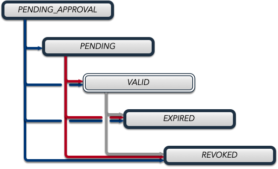

.. _certificate_management:

|security| Cert Management
===========================

.. _certificates_and_private_keys:

Public and Private Keys
-----------------------

Each EPICS agent maintains a public/private key pair for identification:

- The public key identifies the agent to peers. Its shorthand representation is an 8-character SKID.
- The private key must be protected like a password.
- Both keys are stored in the keychain file.
- If the keychain file contains no key pair, any ``authnxxx`` tool will generate one automatically and store it there.
- An established key pair is reused for all subsequent certificate requests.

Identity assertion works as follows: each peer presents a certificate and signs a challenge with its private key. The verifying peer checks the signature against the public key in the certificate, then validates the certificate's chain of trust back to its own Trust Anchor (Root CA).

Private keys must be stored in a keychain file inaccessible to other users or processes. Use a separate keychain file per certificate.

Trust Establishment
-------------------

Each EPICS agent must have a copy of the Root CA certificate in its keychain file to verify certificates presented by peers. A certificate signed by an untrusted CA is rejected.

Even agents that do not hold their own certificate must have a copy of the Root CA, referred to here as the ``Trust Anchor``.

Administrators distribute PKCS#12 files containing the Root certificate to all clients. These files must be stored at the path specified by ``EPICS_PVA_TLS_KEYCHAIN`` or its equivalent.

Certificates
------------

A certificate is the document exchanged with a peer to establish identity. It contains the agent's subject name and public key.

- A certificate is not private and can be shared with any peer. The keychain file that stores it also contains the private key and must not be shared.
- A certificate is valid for a fixed time period.
- A certificate can be revoked by an administrator (status monitoring is included by default).

Certificate Attributes
----------------------

- ``subject``: The entity to which the certificate was issued

  - ``name``: Common name (username, application name, or other identifier)
  - ``organization``: Hostname, institution, domain, or realm
  - ``organizational unit``: Optional subdivision of the organization
  - ``country``: Two-letter country code. Default: ``US``

- ``issuer``: The certificate authority that issued the certificate
- ``serial number``: Unique serial number for the certificate
- ``validity period``:

  - ``notBefore``: Date and time before which the certificate is not valid
  - ``notAfter``: Date and time after which the certificate is not valid

- ``public key``: Public key of the certificate subject
- ``private key``: Private key of the certificate subject. Not stored in the certificate; stored in the keychain file.
- ``SPVA certificate status extension``: PV name where certificate status can be monitored
- ``SPVA config uri extension``: PV name where certificate configuration can be monitored

Certificate States
------------------

- ``PENDING_APPROVAL``: Awaiting administrative approval
- ``PENDING``: Not yet valid (before ``notBefore`` date)
- ``VALID``: Currently valid and usable
- ``EXPIRED``: Past ``notAfter`` date
- ``REVOKED``: Permanently revoked by an administrator

.. _certificate_status_message:

Certificate Status Message
--------------------------

Status response structure:

.. code-block:: console

    Structure
        enum_t     status               # PENDING_APPROVAL, PENDING, VALID, EXPIRED, REVOKED
        UInt64     serial               # Certificate serial number
        string     state                # String representation of status
        enum_t     ocsp_status          # GOOD, REVOKED, UNKNOWN
        string     ocsp_state           # OCSP state string
        string     ocsp_status_date     # Status timestamp
        string     ocsp_certified_until # Validity period end
        string     ocsp_revocation_date # Revocation date if applicable
        UInt8A     ocsp_response        # Signed PKCS#7 encoded OCSP response

.. _certificate_creation_request_CCR:

Certificate Creation Request (CCR)
-----------------------------------

Sent to :ref:`pvacms` to request a new certificate. The request is a PVStructure with the following fields:

.. code-block:: console

    Structure
        string     type               # std, krb, ldap
        string     name               # Certificate subject name
        string     country            # Optional: Country code
        string     organization       # Optional: Organization name
        string     organization_unit  # Optional: Unit name
        UInt16     usage              # Certificate usage flags:
                                        #   0x01: Client
                                        #   0x02: Server
                                        #   0x03: Client and Server
                                        #   0x04: Intermediate Certificate Authority
                                        #   0x08: CMS
                                        #   0x0A: Any Server
                                        #   0x10: Certificate Authority
        UInt32     not_before         # Validity start time (epoch seconds)
        UInt32     not_after          # Validity end time (epoch seconds)
        string     pub_key            # Public key data
        enum_t     status_monitoring_extension  # Include status monitoring
        structure  verifier           # Optional: Authenticator specific data

The ``verifier`` sub-structure is present only when ``type`` references a
:ref:`pvacms_type_1_auth_methods` or :ref:`pvacms_type_2_auth_methods` authenticator.

Certificate Usage
-----------------

Clients request certificates from :ref:`pvacms` by submitting a CCR containing their public key. The process: generate a key pair, submit the CCR, receive a signed certificate, and install it at the configured keychain location.
